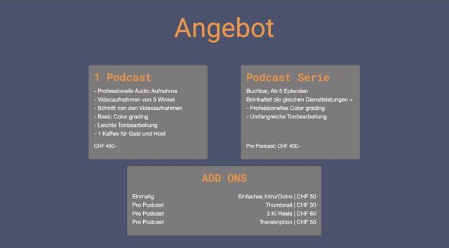
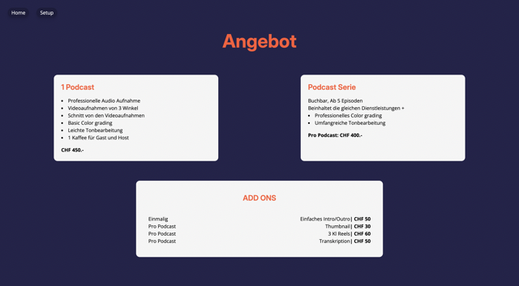
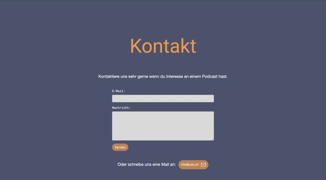
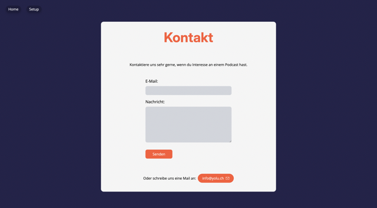

+++
title = "3 Frameworks, doch welches ist das beste?"
date = "2024-09-02"
draft = false
pinned = false
image = "mittel-dall-e-2024-09-02-16.11.48-a-symbolic-representation-of-various-frameworks-used-to-create-a-website.-the-image-should-feature-a-large-central-web-browser-window-with-different-.jpeg"
+++


Ich habe vor kurzer Zeit eine Webseite für das Podcast-Studio im Effinger erstellt, und diese habe ich mit drei verschiedenen Frameworks gemacht. Denn ich wollte wissen, was der Unterschied zwischen diesen ist und welches sich für mich am besten anfühlt. Ich habe mich für die Version mit Tailwind entschieden, da diese am umfangreichsten ist und trotzdem noch den HTML- und CSS-Code vereinfacht. Zudem kann ich alles in mein HTML schreiben, ohne dazu noch CSS zu benötigen.

Hier ist der Angebotsteil der Webseite mit Screenshots und dem dazugehörigen Code:

.")





# Code:

### Html – Css:

##### Html Code:

```
<section class="angebot">
        <h2>Angebot</h2>
        <div class="offerings">
            <div class="offer">
                <h3>1 Podcast</h3>
                <p>- Professionelle Audio Aufnahme<br>
                    - Videoaufnahmen von 3 Winkel<br>
                    - Schnitt von den Videoaufnahmen<br>
                    - Basic Color grading<br>
                    - Leichte Tonbearbeitung<br>
                    - 1 Kaffee für Gast und Host<br>
                <p class="bold">CHF 450.-</p>
                </p>
            </div>
            <div class="offer">
                <h3>Podcast Serie</h3>
                <p>Buchbar, Ab 5 Episoden<br>
                    Beinhaltet die gleichen Dienstleistungen +<br>
                    - Professionelles Color grading<br>
                    - Umfangreiche Tonbearbeitung<br><br>
                <p class="bold">Pro Podcast: CHF 400.-</p>
                </p>
            </div>
        </div>
        <div class="add-ons">
            <h3>ADD ONS</h3>
            <p class="linksbündig">Einmalig<br>
                Pro Podcast <br>
                Pro Podcast <br>
                Pro Podcast <br></p>
            <p class="rechtsbündig">Einfaches Intro/Outro | CHF 50<br>
                Thumbnail | CHF 30<br>
                3 Kl Reels | CHF 60<br>
                Transkription | CHF 50</p>
        </div>
    </section>
```

##### Css Code:

```
.angebot {
    text-align: center;
    padding: 40px;
}

.offerings {
    display: flex;
    justify-content: space-around;
    margin-top: 20px;
}

.offer {
    background-color: #7c7c7c;
    padding: 5px 10px;
    border-radius: 20px;
    width: 30%;
}

.offer h3,
p {
    text-align: left;
    margin: 0;
    margin-top: 20px;
    margin-left: 10px;
}

.add-ons {
    display: grid;
    grid-template-columns: 1fr 1fr 1fr;
    background-color: #7c7c7c;
    padding: 20px;
    border-radius: 20px;
    width: 50%;
    margin: 80px auto;
    justify-content: center;
    align-items: baseline;
}

.add-ons h3 {
    margin: 20px 0px;
    grid-column: span3;
    grid-column-start: 1;
}

.add-ons .rechtsbündig {
    text-align: right;
    margin: 0px 50px 20px;
    grid-column: span2;
    grid-column-start: 2;
}

.add-ons .linksbündig {
    margin-left: 40px;
}

.button {
    display: inline-block;
    padding: 10px 25px;
    margin-top: 40px;
    background-color: #c58048;
    color: white;
    text-decoration: none;
    border-radius: 50px;
}
```


### Html & Bootstrap Code:

```
<section class="container text-center my-5">
        <h2 class="akzent-color">Angebot</h2>
        <div class="row justify-content-around">
            <div class="col-md-5 mb-4">
                <div class="card bg-dark border-0 rounded-lg">
                    <div class="card-body border-0 rounded-lg" style="background-color: #7c7a7a;">
                        <h3 class="card-title text-left">1 Podcast</h3>
                        <p class="card-text text-left">
                            - Professionelle Audio Aufnahme<br>
                            - Videoaufnahmen von 3 Winkel<br>
                            - Schnitt von den Videoaufnahmen<br>
                            - Basic Color grading<br>
                            - Leichte Tonbearbeitung<br>
                            - 1 Kaffee für Gast und Host<br>
                        </p>
                        <p class="font-weight-bold text-left" style="font-size: 1.2em;">CHF 450.-</p>
                    </div>
                </div>
            </div>
            <div class="col-md-5 mb-4">
                <div class="card bg-dark border-0 rounded-lg">
                    <div class="card-body border-0 rounded-lg" style="background-color: #7c7a7a;">
                        <h3 class="card-title text-left">Podcast Serie</h3>
                        <p class="card-text text-left">
                            Buchbar, Ab 5 Episoden<br>
                            Beinhaltet die gleichen Dienstleistungen +<br>
                            - Professionelles Color grading<br>
                            - Umfangreiche Tonbearbeitung<br><br><br>
                        </p>
                        <p class="font-weight-bold text-left" style="font-size: 1.2em;">Pro Podcast:
                            CHF 400.-</p>
                    </div>
                </div>
            </div>
        </div>
        <div class="row mb-4">
            <div class="col-8 offset-md-2">
                <div class="card bg-dark rounded-lg">
                    <div class="card-body border-0 rounded-lg" style="background-color: #7c7a7a;">
                        <h3 class="text-center">ADD ONS</h3>
                        <div class="row">
                            <div class="col-md-4 text-left">
                                <p>Einmalig<br>Pro Podcast <br>Pro Podcast <br>Pro Podcast <br></p>
                            </div>
                            <div class="col-md-8 text-right">
                                <p>Einfaches Intro/Outro | CHF 50<br>Thumbnail | CHF 30<br>3 Kl Reels | CHF
                                    60<br>Transkription | CHF 50</p>
                            </div>
                        </div>
                    </div>
                </div>
            </div>
        </div>
    </section>
```


### Html & Tailwind Code:

```
<section class="text-center text-graygray p-10 my-24">
    <h2 class="text-6xl font-bold text-sodaorange font-inter mb-20">Angebot</h2>
    <div class="flex flex-col md:flex-row justify-around space-y-6 md:space-y-0">
      <div class="bg-creamwhite p-6 rounded-xl md:w-1/3">
        <h3 class="text-left text-2xl font-semibold text-sodaorange font-inter">1 Podcast</h3>
        <ul class="text-left mt-4 list-disc list-inside">
         <li>Professionelle Audio Aufnahme</li>
          <li>Videoaufnahmen von 3 Winkel </li>
          <li>Schnitt von den Videoaufnahmen </li>
           <li>Basic Color grading</li>
          <li> Leichte Tonbearbeitung</li>
           <li>1 Kaffee für Gast und Host</li>
        </ul>
        <p class="text-left font-bold mt-4">CHF 450.-</p>
      </div>
      <div class="bg-creamwhite p-6 rounded-xl md:w-1/3">
        <h3 class="text-left text-2xl font-semibold text-sodaorange font-inter">Podcast Serie</h3>
        <p class="text-left mt-4">Buchbar, Ab 5 Episoden<br>
          Beinhaltet die gleichen Dienstleistungen +
        </p>
        <ul class="text-left list-disc list-inside">
          <li>Professionelles Color grading</li>
          <li>Umfangreiche Tonbearbeitung</li>
        </ul>
        <p class="text-left font-bold mt-4">Pro Podcast: CHF 400.-</p>
      </div>
    </div>
    <div class="bg-creamwhite p-10 rounded-xl mt-16 mx-auto md:w-1/2 grid grid-cols-2 gap-10 text-left">
      <h3 class="col-span-2 text-2xl text-center font-semibold text-sodaorange font-inter">ADD ONS</h3>
      <div>
        <p>Einmalig<br>
          Pro Podcast <br>
          Pro Podcast <br>
          Pro Podcast <br></p>
      </div>
      <div class="text-right">
        <p>Einfaches Intro/Outro<span class="font-bold">| CHF 50</span><br>
          Thumbnail<span class="font-bold">| CHF 30</span><br>
          3 Kl Reels<span class="font-bold">| CHF 60</span><br>
          Transkription<span class="font-bold">| CHF 50</span></p>
      </div>
    </div>
  </section>
```

Dies sind die 3 Code Elemente für die dazugehörigen Bilder. Ich finde die Tailwind Version ist die beste denn sie ist recht gut aufgeräumt und man kann sie auch einfach responsive machen (handy tauglich).


Hier ist noch der Kontaktteil der Webseite:

.")





# Code:

### Html – Css:

##### Html Code:

```
<section id="kontakt" class="contact">
        <h2>Kontakt</h2>
        <p>Kontaktiere uns sehr gerne wenn du Interesse an eine Podcast hast.</p>
        <form>
            <label for="email">E-Mail:</label>
            <input type="email" id="email" name="email" required>
            <label for="message">Nachricht:</label>
            <textarea id="message" name="message" required></textarea>
            <button type="submit">Senden</button>
        </form>
        <p>Oder schreibe uns eine Mail an: <a href="mailto:info@yolu.ch" class="email-button">info@yolu.ch</a></p>
    </section>
```

##### Css Code:

```

.contact {
    text-align: center;
    padding: 40px;
}

.contact p {
    text-align: center;
}

.contact h2 {
    margin-top: 90px;
    margin-bottom: 60px;
}

.contact form {
    display: flex;
    flex-direction: column;
    align-items: flex-start;
    margin: 70px auto;
    color: white;
    max-width: 600px;
}

.contact form label {
    margin: 10px 0 5px;
    font-size: 13pt;
    justify-self: left;
}

.contact form input,
.contact form textarea {
    width: 100%;
    padding: 10px;
    margin-bottom: 10px;
    border-radius: 15px;
    border: none;
    background-color: #d9d9d9;
}

.contact form input {
    height: 30px;
}

.contact form textarea {
    height: 150px;
}
```

### Html & Bootstrap Code:

```
<section id="kontakt" class="container my-5 text-center">
        <h2 class="akzent-color">Kontakt</h2>
        <p>Kontaktiere uns sehr gerne wenn du Interesse an einem Podcast hast.</p>
        <form action="send_mail.php" method="post" class="text-left col-md-6 offset-md-3 my-5">
            <div class="form-group">
                <label for="email" class="text-white">E-Mail:</label>
                <input type="email" id="email" name="email" class="form-control" style="background-color: #d9d9d9;"
                    required>
            </div>
            <div class="form-group">
                <label for="message" class="text-white">Nachricht:</label>
                <textarea id="message" name="message" class="form-control" required
                    style="background-color: #d9d9d9; height: 150px;"></textarea>
            </div>
            <button type="submit" class="btn button-color rounded-pill">Senden</button>
        </form>
        <div class="d-flex align-items-baseline justify-content-center mt-5">
            <p>Oder schreibe uns eine Mail an: <a href="mailto:info@yolu.ch"
                    class="btn button-color rounded-pill ml-2">info@yolu.ch
                    <svg version="1.0" xmlns="http://www.w3.org/2000/svg" width="25.000000pt" height="25.000000pt"
                        viewBox="0 0 128.000000 128.000000" preserveAspectRatio="xMidYMid meet" class="pl-2">

                        <g transform="translate(0.000000,128.000000) scale(0.100000,-0.100000)" fill="#ffffff"
                            stroke="none">
                            <path d="M75 1111 c-11 -5 -31 -21 -45 -36 l-25 -27 0 -409 0 -409 33 -32 32
                   -33 570 0 570 0 32 33 33 32 0 410 0 410 -33 32 -32 33 -558 2 c-306 1 -566
                   -2 -577 -6z m1075 -95 c-56 -54 -502 -436 -509 -436 -7 0 -464 391 -516 441
                   -19 19 -12 19 515 19 l535 0 -25 -24z m-736 -353 c116 -101 218 -183 226 -183
                   8 0 137 105 285 234 l270 233 3 -340 c2 -242 -1 -344 -9 -353 -16 -19 -1078
                   -21 -1097 -2 -9 9 -12 102 -12 356 l0 344 62 -54 c34 -29 157 -135 272 -235z" />
                        </g>
                    </svg></a></p>
        </div>
    </section>
```


### Html & Tailwind Code:

```
<div class="flex justify-center">
    <section id="kontakt" class="flex flex-col bg-creamwhite rounded-xl w-fit text-center py-10 px-32 my-16 text-graygray">
      <h2 class="text-6xl font-bold text-sodaorange font-inter mb-20">Kontakt</h2>
      <p class="mb-12">Kontaktiere uns sehr gerne, wenn du Interesse an einem Podcast hast.</p>
      <form class="max-w-96 mx-auto flex flex-col items-start">
        <label for="email" class="mb-2 text-lg">E-Mail:</label>
        <input type="email" id="email" name="email" required class="min-w-96 p-2 mb-4 rounded-lg bg-gray-300">
        <label for="message" class="mb-2 text-lg">Nachricht:</label>
        <textarea id="message" name="message" required class="min-w-96 p-2 mb-8 rounded-lg bg-gray-300 h-40"></textarea>
        <button type="submit" class="self-left py-2 px-8 mb-9 bg-sodaorange text-white rounded-lg ease-in-out dutation-300">Senden</button>
    </form>  
      <p class="mt-8 flex items-center self-center">Oder schreibe uns eine Mail an: <a href="mailto:info@yolu.ch"
          class="flex no-underline w-fit bg-sodaorange rounded-full px-5 py-2 ml-2 text-white transition duration-0 ease-out hover:duration-500 hover:ease-in">info@yolu.ch 
          <svg class="pl-2" version="1.0" xmlns="http://www.w3.org/2000/svg"
          width="18.000000pt" height="18.000000pt" viewBox="0 0 128.000000 128.000000"
          preserveAspectRatio="xMidYMid meet">
         
         <g transform="translate(0.000000,128.000000) scale(0.100000,-0.100000)"
         fill="#ffffff" stroke="none">
         <path d="M75 1111 c-11 -5 -31 -21 -45 -36 l-25 -27 0 -409 0 -409 33 -32 32
         -33 570 0 570 0 32 33 33 32 0 410 0 410 -33 32 -32 33 -558 2 c-306 1 -566
         -2 -577 -6z m1075 -95 c-56 -54 -502 -436 -509 -436 -7 0 -464 391 -516 441
         -19 19 -12 19 515 19 l535 0 -25 -24z m-736 -353 c116 -101 218 -183 226 -183
         8 0 137 105 285 234 l270 233 3 -340 c2 -242 -1 -344 -9 -353 -16 -19 -1078
         -21 -1097 -2 -9 9 -12 102 -12 356 l0 344 62 -54 c34 -29 157 -135 272 -235z"/>
         </g>
         </svg></a></p>
    </section>
  </div>
```

Dies sind die 3 Code Elemente für die dazugehörigen Bilder. Auch hier finde ich die Tailwind Version die beste.


Ich habe zwischenzeitlich auch mal mit ChatGPT eine art von Galerie erstellt jedoch werde ich hier die von PhotoSwipe nehmen da dies auf alle Betriebssysteme und Online Plattformen ohne Probleme läuft. 

.")

# Code:

### Html Code:

```
<section class="gallery">
        <section class="gallery">
            <h2>Galerie</h2>
            <div class="gallery-container">
                <div class="gallery-item" onclick="openModal(0)">
                    
                </div>
                <div class="gallery-item" onclick="openModal(1)">
                    
                </div>
                <div class="gallery-item" onclick="openModal(2)">
                    
                </div>
                <div class="gallery-item" onclick="openModal(3)">
                    
                </div>
                <div class="gallery-item" onclick="openModal(4)">
                    
                </div>
            </div>
        </section>

        <div id="galleryModal" class="modal">
            <span class="close" onclick="closeModal()">&times;</span>
            <div class="modal-content">
                
            </div>
            <a class="prev" onclick="changeImage(-1)">&#10094;</a>
            <a class="next" onclick="changeImage(1)">&#10095;</a>
        </div>
        <a href="/setup/index.html" class="galerie-button">Infos zum Setup</a>
    </section>
```


### Css Code:

```
.gallery {
    text-align: center;
    padding: 40px;
}

.gallery-container {
    position: relative;
    width: 600px;
    height: 220px;
    margin: 0 auto;
}

.gallery-item {
    position: absolute;
    cursor: pointer;
    transition: transform 0.3s;
}

.gallery-item img {
    width: 300px;
    height: 200px;
    object-fit: cover;
    border-radius: 10px;
}

.gallery-item:nth-child(1) {
    left: 0;
    top: 20px;
    z-index: 3;
}

.gallery-item:nth-child(2) {
    left: 50px;
    top: 10px;
    z-index: 4;
}

.gallery-item:nth-child(3) {
    left: 100px;
    top: 0;
    z-index: 5;
}

.gallery-item:nth-child(4) {
    left: 150px;
    top: 10px;
    z-index: 4;
}

.gallery-item:nth-child(5) {
    left: 200px;
    top: 20px;
    z-index: 3;
}

.gallery-item:hover {
    transform: scale(1.05);
}

.modal {
    display: none;
    position: fixed;
    z-index: 10;
    padding-top: 60px;
    left: 0;
    top: 0;
    width: 100%;
    height: 100%;
    overflow: auto;
    background-color: rgba(0, 0, 0, 0.9);
}

.modal-content {
    display: flex;
    justify-content: center;
    align-items: center;
    height: 100%;
}

.modal-content img {
    max-width: 80%;
    max-height: 80%;
    border-radius: 10px;
}

.close {
    position: absolute;
    top: 15px;
    right: 35px;
    color: #fff;
    font-size: 40px;
    font-weight: bold;
    transition: 0.3s;
    cursor: pointer;
}

.close:hover,
.close:focus {
    color: #bbb;
    text-decoration: none;
    cursor: pointer;
}

.prev,
.next {
    cursor: pointer;
    position: absolute;
    top: 50%;
    width: auto;
    padding: 16px;
    color: white;
    font-weight: bold;
    font-size: 20px;
    transition: 0.3s;
    user-select: none;
}

.prev {
    left: 0;
}

.next {
    right: 0;
}

.prev:hover,
.next:hover {
    background-color: rgba(0, 0, 0, 0.8);
}
```


### JavaScript Code:

```
let currentImageIndex = 0;
const images = [
    "https://picsum.photos/300/200?1",
    "https://picsum.photos/300/200?2",
    "https://picsum.photos/300/200?3",
    "https://picsum.photos/300/200?4",
    "https://picsum.photos/300/200?5"
];

function openModal(index) {
    currentImageIndex = index;
    document.getElementById("modalImage").src = images[currentImageIndex];
    document.getElementById("galleryModal").style.display = "block";
}

function closeModal() {
    document.getElementById("galleryModal").style.display = "none";
}

function changeImage(direction) {
    currentImageIndex += direction;
    if (currentImageIndex < 0) {
        currentImageIndex = images.length - 1;
    } else if (currentImageIndex >= images.length) {
        currentImageIndex = 0;
    }
    document.getElementById("modalImage").src = images[currentImageIndex];
}

```


Vielleicht hast du nun nichts verstanden und möchtest dich mit dem (Programmieren) von Webseiten auseinandersetzen oder denkst «Man hätte dies so viel einfacher machen können» Doch so oder so ich hoffe ihr nehmt etwas aus diesem Blog Eintrag mit.   : )