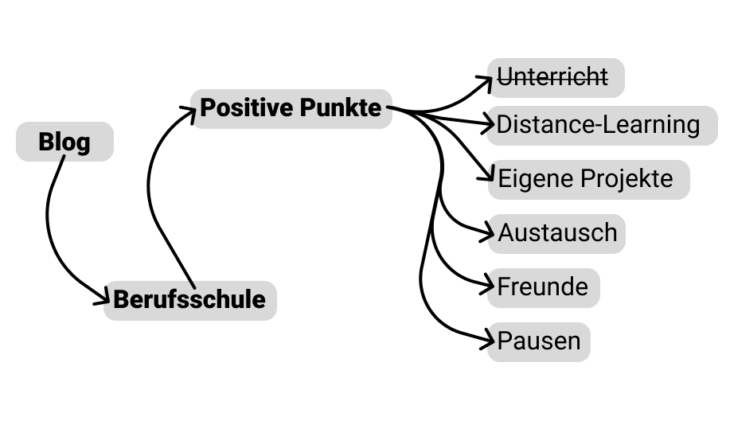

+++
title = "5 positive Dinge der Berufsschule"
date = "2025-01-22"
draft = false
pinned = false
tags = ["Schulsystem"]
image = "5_positive_punkte.png"
+++

Ich sagte in einem vorherigen [Blog](https://www.maelduwan.ch/vielleicht-pragt-mich-das-system-doch-mehr-als-es-mir-lieb-ist/), dass ich in einem nächsten Blog am liebsten über das Schulsystem schwärmen würde. Dies kann ich jedoch auch jetzt nicht. Doch ich werde euch in diesem Blog 5 positive Dinge in der Berufsschule aufzeigen.

**Erstens:**\
Der Austausch mit anderen Gleichaltrigen, die die gleichen Interessen haben. Dadurch können wir spannende Diskussionen über Teile unseres Jobs führen. Ich kann mich mit Personen austauschen, die ein ähnliches Interessensfeld haben und auch vom Wissen her auf einem ähnlichen Stand sind. Dies ist sehr interessant, da man so gut mit verschiedenen Perspektiven und Herangehensweisen konfrontiert wird und darüber sprechen kann.

**Zweitens:**\
Ich habe fast zwei ganze Tage pro Woche Zeit, um an eigenen Projekten zu arbeiten. Das einzige Problem, das existiert, ist, dass man den Lehrpersonen zuhören muss, da sie sonst ziemlich genervt sein können. Abgesehen davon, dass man dieses Kriterium erfüllen muss, ist das Arbeiten an eigenen Projekten in der Berufsschule ziemlich spannend oder zumindest viel spannender als der Unterricht.\
Ein weiterer positiver Punkt, wenn man an eigenen Projekten arbeitet, ist, dass man viel lernt. Denn dort, wo man ansteht und ein Problem hat, hat man auch die Motivation, dieses zu lösen. Zuletzt ist das Arbeiten an eigenen Projekten in der Berufsschule eine Art, wie man die Kompetenz des Multitaskings trainieren und weiter ausbilden kann. Denn man muss sich auf den Unterricht und gleichzeitig auf das eigene Projekt konzentrieren, und das hilft dabei, sich auch später auf mehrere Sachen gleichzeitig konzentrieren zu können.

**Drittens:**\
Neue Freunde finden oder Freunde in der Klasse auf dem Hin- und Rückweg sowie auch in der Schule selbst zu sehen. Sich mit diesen auszutauschen und lustige Momente zu erleben, ist sehr wichtig und auch schön zu erleben.

**Viertens:**\
Homeschooling-Tage! Denn wenn wir wieder einmal Distance-Learning haben, dann treffe ich mich mit Freunden bei mir zu Hause, und wir haben einen lustigen Tag, an dem wir so gut wie sonst nie unbemerkt nicht am Unterricht teilnehmen können. An diesen Tagen haben wir schon Karaoke gesungen oder auch Fußball gespielt. Dies sind immer die lustigsten (Berufsschul-)Tage, da wir zusammen eine wirklich gute Zeit haben und enorm viel Sozialkompetenz erarbeiten.

**Fünftens:**\
PAUSEN! JEDE PAUSE IST EIN WUNDERBARES GEFÜHL VON BEFREIUNG UND JEDE PAUSE IST WICHTIG! Wie gesagt, sind Pausen, egal in welcher Länge oder Form, immer etwas vom Besten am ganzen Berufsschulalltag. Denn Pausen sind gut für die sozialen Kontakte, den Austausch zwischen den Lernenden, für manche auch zum Rauchen, und für andere einfach, um zu sein und mal nichts zu machen. Pausen sind auch wichtig für die Erholung, und von dieser braucht man in der Berufsschule sehr viel.

Ich hoffe, das hat einen kleinen Überblick über die positiven Dinge der Berufsschule gegeben.

Andere Blogs zum Schulsystem und wie ich dieses empfinde, findet ihr unter dem [\#Schulssystem](https://www.maelduwan.ch/tags/schulsystem/)