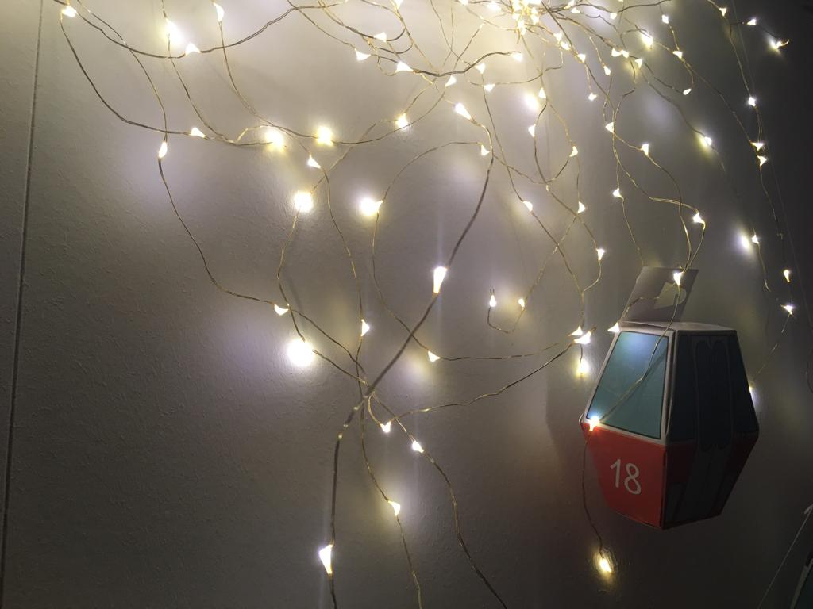

+++
title = "Adventskalender"
date = "2020-11-15"
draft = false
pinned = false
image = "advenzkalender1.jpg"
+++

Ich und meine Familie haben diese Woche einen Adventskalender angefangen zu basteln. Der Adventskalender besteht aus kleinen Papiergondeln. Jeder aus der Familie macht in sechs von den Gondeln eine kleine Überraschung für die anderen hinein. Ich gebe wahrscheinlich ein paar Süssigkeiten und andere Kleinigkeiten in die Gondeln. In der Anleitung steht, dass man die Gondeln ohne Kleber und andere Sachen zusammenstecken kann. Wir haben es versucht aber nicht ohne Kleber geschafft. Ich freue mich jetzt schon darauf gemeinsam ein par "Güetzi" zu Backen.