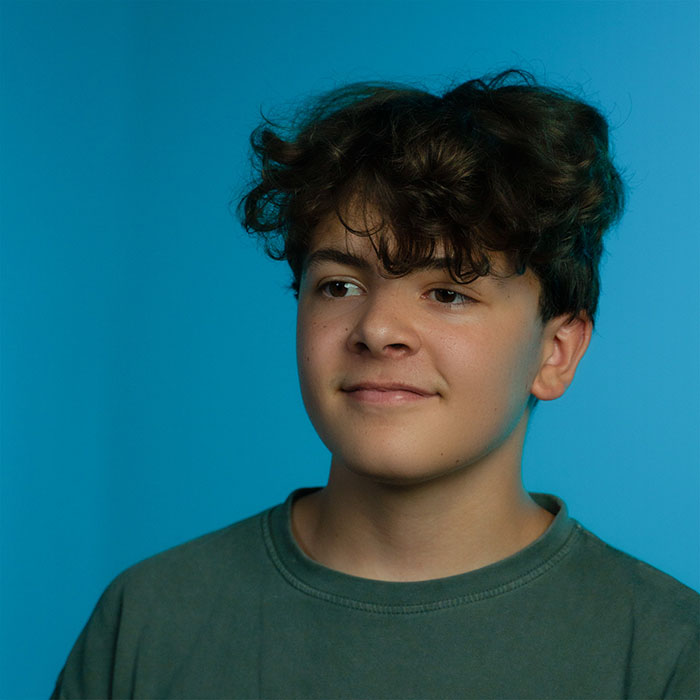

+++
title = "Berufsportrait über Joscha Tschanz"
date = "2023-10-19"
draft = false
pinned = false
image = "joscha.jpg"
+++

Joscha Tschanz – Kein normales Leben

Joscha Tschanz ist ein innovativer und freiheitsliebender Lehrling. Mit vielen Visionen und enormer Kreativität steigt er zwischen AI-Tools und echten, erfahrenen Personen in die Arbeitswelt ein.

26.09.2023 Maël Duwan

«Ich habe abgespacte Ideen», sagt Joscha Tschanz lachend. Der Mediamatiker-Lehrling möchte später selbständig werden, doch vielleicht auch einfach nur reisen. Zwischen Film, Foto, Design und AI-Tools bewegt er sich am liebsten. Dank seinen Fähigkeiten, kombiniert mit seiner Kreativität und seiner wissensbegierigen Persönlichkeit, stehen ihm alle Wege offen. 

Mediamatiker, aber weshalb?
Wieso hat er sich für eine Lehre als Mediamatiker entschieden? «Schon in meiner Zeit im Homeschooling war ich immer im Effinger», erklärt Joscha. Der Effinger ist ein Coworking-Space mitten in Bern, wo viele junge Unternehmer:innen aus allen möglichen Branchen selbständig ein Unternehmen aufbauen. «Dort habe ich mich mit allen möglichen Themen, die mich interessieren, auseinandersetzen können, dadurch habe ich gemerkt, dass die Mediamatiker-Lehre fast alle meine Interessenfelder abdeckt und ich mich in diesem Beruf ausleben kann.» 

Viele Aspekte seines neuen Berufs begeistern ihn. Joscha sagt dazu: "Ich bin allgemein recht interessiert und neugierig, darum finde ich es cool, dass es so verschiedene Sachen gibt, die ich alle ausprobieren darf." Zudem interessieren ihn die Fotografie und das Filmen. Er sagt auch, dass er sehr gerne kreativ arbeite, und dass dies in diesem Job möglich sei. 
AI-Tools in Joschas Leben
«Ich bin sehr interessiert an AI-Tools», sagt Joscha und er unterstützt, dass diese an Schulen unterrichtet werden. Er erkennt jedoch auch potenzielle Nachteile, besonders im kreativen Bereich, wo Faulheit und der Verlust von kreativer Arbeit drohen könnten. Er befürchtet auch, dass Menschen mit der Zeit das Gefühl haben könnten, dass AI-Tools ihre Selbstständigkeit ersetzen. Obwohl er selbst AI-Tools häufig nutzt und ihre Vorteile in Bezug auf Zeitersparnis, Informationszugang und Inspiration schätzt. Weiter sagt er auch, dass sie immer noch menschliche Kreativität und Anleitung erfordern. Deshalb glaubt er nicht, dass sie unsere Jobs vollständig ersetzen werden. 

«Das Schulsystem ist für die Katz»
«Man sollte lernen, wie man lernt. Nicht einfach Schulstoff auswendig lernen.» Joschas Meinung ist in diesem Thema schon sehr ausgeprägt. Er selbst war sechs Jahre in der öffentlichen Schule, danach wechselte er ins Homeschooling. Da seine Mutter Lehrerin ist, hatte er das Glück, dass er ohne Probleme wechseln konnte. Wechselte dann aber bald auch in den Effinger und in andere Angebote, so dass er nicht mehr nur im Homeschooling war. 

Im Effinger lernte er sehr viele interessante und auch sehr hilfsbereite Menschen mit viel Wissen kennen. Daher befürwortet Joscha mehr Freiraum in der Bildung, um die Kreativität zu fördern. Er lehnt das Benotungssystem ab und würde es am liebsten abschaffen. Außerdem möchte er in der Schule eine erweiterte Informationsbeschaffung, nicht alleine durch Lehrer, sondern auch durch Experimente, Google und AI-tools.
Mit der Kamera um die Welt
Nach der Lehre würde er noch eine Zeit lang arbeiten. Doch dann möchte er gerne so schnell wie möglich versuchen, selbständig zu werden, im Bereich Film und Foto. Das Reisen ist einer der Träume, die er sich unbedingt verwirklichen möchte. «Vor allem», sagt er, «möchte ich etwas Unabhängiges und Freies im Thema Film machen, wo ich meine Ideen einfließen lassen kann.» Darum könnte er sich auch vorstellen, nach der Lehre in einer Filmfirma zu arbeiten.

Joscha Tschanz wurde am 19.01.2007 in Ostermundigen geboren. Seine Eltern Sibille Tschanz und Stephan Tschanz sind beide in sozialen Berufen tätig. Seine Mutter Sibille ist Schulleiterin in einer Spezialschule, sein Vater ist Fachmann Gesundheit bei der Spitex. Joscha hat noch einen kleineren Bruder, Dieser heisst Timo Tschanz ist 14 Jahre alt und noch in der Schule. Joscha besuchte die Schule bis zur sechsten Klasse zuerst in Stettlen und dann im Homeschooling. Nun absolviert er eine Lehre als Mediamatiker bei YOLU.