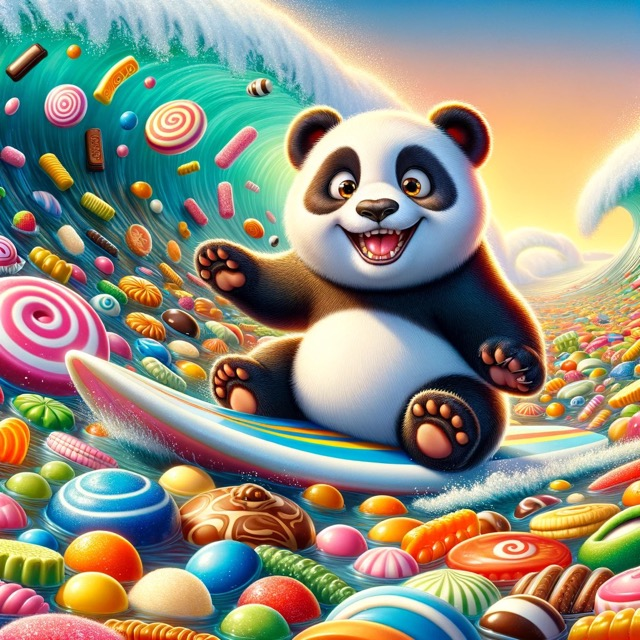
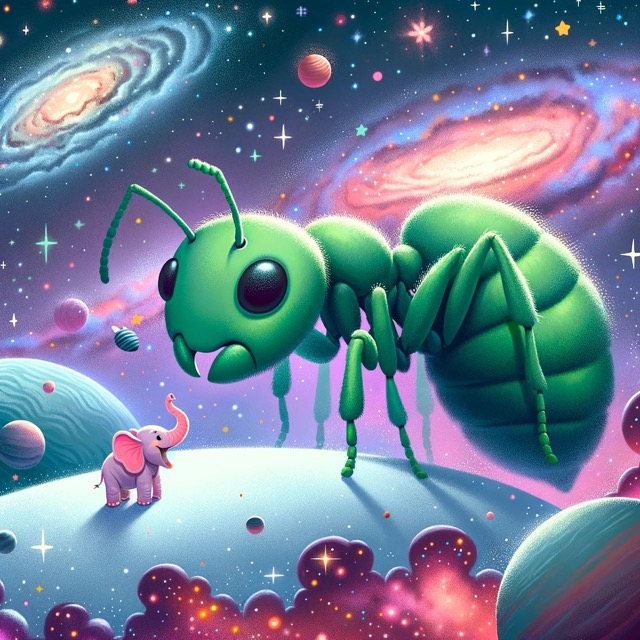

+++
title = "Chat GPT Learning"
date = "2023-11-22"
draft = false
pinned = false
image = "mittel-himmel.jpeg"
+++

### **GPT 4.0**

Chat GPT kann seit neustem auch Bilder generieren, genau das bin ich, unteranderem gerade am entdecken und lernen. Für was ich bisher Bilder generiert habe:

1. Eine kleine Webseite die auch schon Online ist: <https://onepager.yolu.ch/>
2. Ich habe mit ein par Jugendlichen bei dem Berufsworkshop den ich Leite Bilder Generiert Hier ein par Beispiele:

   

   

   

   

Diese Bilder wurden alle mit so wenig Wörter im Prompt wie nur möglich generiert.

   3. Ich habe Bilder generiert, mit denen ich einfach Prompts schreiben gelernt habe.

**Was ich gelernt habe**

Ich habe mich nun mit den Grundlagen zum Schreiben von Promtps auseinandergesetzt. Nun weiss ich, wie man circa einen Prompt aufbauen muss um das gewünschte Ziel zu erreichen und welche Dinge wichtig zu beachten sind.

Dazu habe ich gelernt dass man auch mit wirklich wenigen, sozusagen schon fast in Stichworten mit Chat GPT Kommunizieren kann und dieser versteht immer noch was man möchte (solange es nicht allzu kompliziert ist).

Wo ich der grössten Lerneffekt hatte, war als ich verstanden habe das auch wenn ich ein Wort schreibe dass fast exakt das gleiche heisst wie ein anderes aber trotzdem nicht genau das gleiche, dass es dann etwas ganz anderes generiert. Das heisst wiederum das **kleine Veränderungen Grosses bewirken können.** Dies ist auch im echten Leben so, doch hier sieht man enorm gut was für ein Impact eine kleine Veränderung haben kann.

**Was ich für die Zukunft mitnehme**

* Kleine Veränderungen können Grosses bewirken.
* Prompts müssen nicht immer enorm ausführlich geschrieben sein, damit man ein zufriedenstellendes Ergebnis hat.
* Je detaillierter man ein Bild/Ergebnis haben möchte desto genauer muss man im Promt beschreiben was man will.
* Chat GPT ist eine enorme Hilfe, wenn es darum geht Zeit zu sparen und Inspiration zu finden.