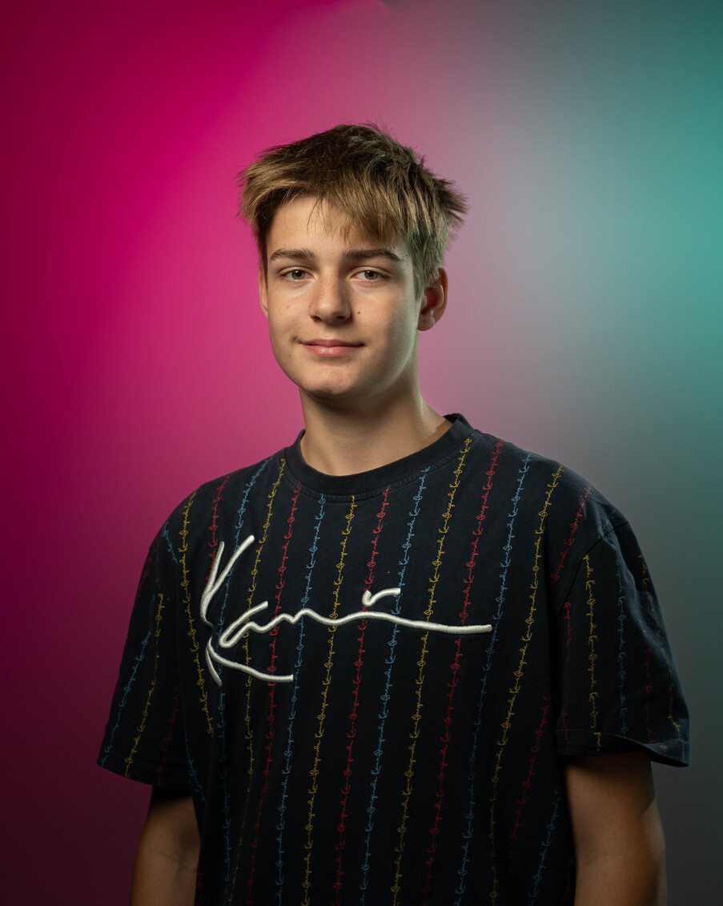
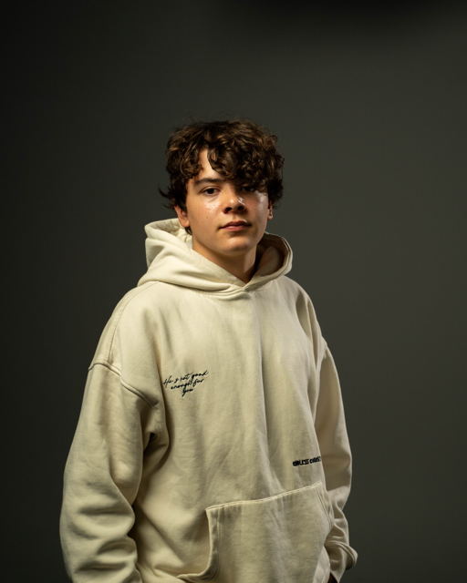
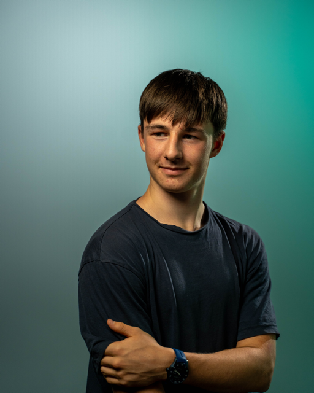

+++
title = "Der erste Berufsworkshop den ich geleitet habe"
date = "2023-10-25"
draft = true
pinned = false
image = "_ssp9895.jpg"
+++

Heute habe ich meinen ersten Berufsworkshop geleitet. Mit der Hilfe von Joscha habe ich einen ganzen tag mit einem Jugendlichen der sich für den Beruf Mediamatiker interessiert, vorbereitet und nun durchgeführt. Im vorhinein habe ich einen code programmiert den die Schnuppernden dann kopieren und danach anpassen können (während dem Workshop). Dazu habe ich mir ein ganzes Tagesprogramm mit allen Einzelheiten ausgedacht und getestet. 

Wir haben richtig coole Portraits erstellt, da wir im Studio mit professionellen Mitteln arbeiten konnten. Eines dieser Portraits habe ich bereits als Titelbild von diesem Blog verwendet und hier sind noch zweit weitere:

Diese zwei Bilder hat die Person die heute am Schnuppern war von mir und Joscha erstellt, es ist unglaublich was für einen risen Qualitätsunterschied ein professionelles Licht setup macht. Ich und Joscha haben schon einmal Portrait für mich und ihn erstellt doch zu dieser zeit hatten wir noch keine Ahnung wie man ein Licht setup aufbaut und auf was man sich achten sollte. Auch jetzt können wir noch kein professionelles Licht setup aufstellen aber wir wissen zumindest ca. wie es geht und auf was man schauen sollte.