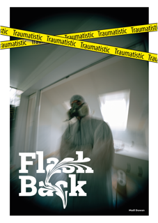
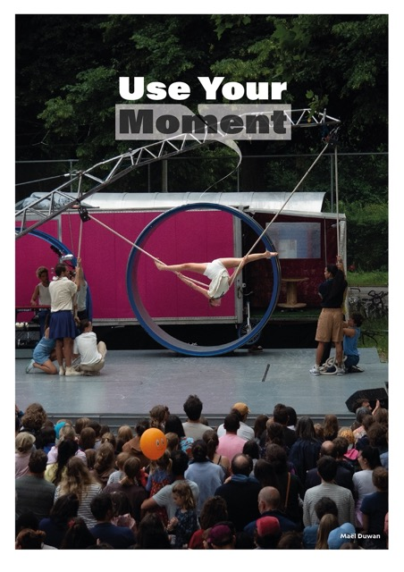

+++
title = "Design ist nichts für mich… oder doch?"
date = "2024-07-09"
draft = false
pinned = false
image = "flash-back.png"
footnotes = "Wichtiges Indiz für diesen Blog:\n\nAlle Fotos, die hier zu sehen sind, habe ich selber gemacht und bearbeitet, auch jedes Design-Element wurde von mir erstellt und hinzugefügt."
+++
Auf der Suche nach einem Lernprojekt bin ich durch die Mediamatiker-Kompetenzen gegangen und habe gemerkt, dass ich mich im Moment am meisten für Fotografie interessiere. Doch dies wirkte nicht so einfach umzusetzen, deshalb habe ich noch weiter gestöbert und gedacht: «Ich habe doch vor einer Woche ein Tutorial auf Instagram gesehen. In dem ging es darum, wie man gewisse Tools von Illustrator einsetzen kann.» Dadurch bin ich dann auf die Idee gekommen, ich könnte doch versuchen, mit Bildern, die ich gerne habe, Plakate zu designen (auch wenn mich das Thema Design noch nie richtig begeistert hat).

Nun bin ich seit insgesamt 8 Stunden an Plakaten am Arbeiten, die ich, sobald ich sie fertiggestellt habe, den Personen von den Bildern schenken möchte.

Bei einem davon bin ich selbst auf dem Bild zu sehen und deshalb werde ich mir dieses in meinem Zimmer aufhängen.

#### Was ich bei der Arbeit mit Illustrator gelernt habe:

Bei diesem Bild habe ich gelernt, wie ich mit dem Tool Pathfinder richtig umgehe und was dieses kann. Denn ich musste bei dem Plakat darauf achten, dass die gelben Streifen nicht über das Plakat hinausgehen, sondern nur bis ganz an den Rand. Geschafft habe ich das dann damit:

Den Effekt beim Text «Flash Back» habe ich mit einem Verzerren-Werkzeug geschaffen (dieses habe ich auf Instagram als Tutorial gefunden und dann nachgestellt).

\
All in all, finde ich dies mein bestes Plakat, da ich hier (meiner Meinung nach) am kreativsten war mit den verschiedenen Design-Elementen. Jedoch hat mich dieses Plakat auch am meisten Zeit gekostet, insgesamt ca. 2 Stunden.

#### Beim zweiten Plakat:

\
Habe ich mich für die gleiche Art der Verzerrung des Textes entschieden und dazu dieses Verzerr-Tool gebraucht:

Das Schwierigste bei diesem Plakat war, dass der Strich, der so nach oben geht, wie ein schöner rundlicher Strich aussieht und nicht verwackelt ist. Dies habe ich erst nach ziemlich vielen Versuchen geschafft.

#### Das dritte Plakat:

Hier habe ich weitere Tools des Verzerers gebraucht. Einmal das Zusammenziehen-Werkzeug, dann das Aufblasen-Werkzeug, auch das Ausbuchtung-Werkzeug und zum Schluss noch das Zerknittern-Werkzeug. Hier wäre noch ein Bild von meinem Fortschritt mit der Schrift:

#### Das vierte Plakat:

Hier habe ich mich mit Formen und Farben versucht zu testen, wie kreativ ich bin, und habe viele Versionen gehabt. Dies ist meine beste Version, denn sie verschwindet in dem Hellen von dem Zirkuswagen, was den Effekt bringt, dass es aussieht, als würde es von dort herauskommen. By the way, das Bild von diesem Plakat ist, meiner Meinung nach, das beste von den Bildern, die ich aufgenommen habe.

Ich freue mich über jegliches Feedback zu meinen Plakaten, am besten Feedback, das meine Arbeit verbessert oder mir ein bisschen Aufwind gibt. ;-)