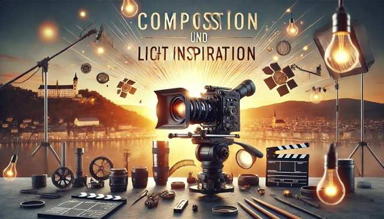

+++
title = "Filmmaking Basics: Komposition, Licht und Sounddesigng Basics: Komposition, Licht und Sounddesign"
date = "2025-01-08"
draft = false
pinned = false
image = "composition-blog.jpeg"
+++

Ich habe letzten Freitag mich mit Filmmaking und was dort alles dazu gehört beschäftigt, hier sind meine Notizen zu unterschiedlichen Bereichen vom Filmmaking. 

## **1. Komposition – Die Kunst des Framings**

#### Die Komposition ist der Grundstein für ein gelungenes Bild oder Video. Hier sind die wichtigsten Prinzipien:

* **The Rule of Thirds**\
  Platziere das Subjekt auf einer der zwei vertikalen oder horizontalen Linien, um eine interessante Komposition zu schaffen. Besonders die vier Schnittpunkte der Linien sind ideale Stellen für Fokuspunkte, da das Auge dort hingeleitet wird.
* **Leading Lines**\
  Natürliche Linien wie Strassen, Zäune oder Flüsse können verwendet werden, um das Subjekt in den Fokus zu rücken.
* **Frame in a Frame**\
  Nutze Elemente wie Fenster oder Türen, um einen zusätzlichen Rahmen innerhalb des Bildes zu schaffen.
* **Negativer Raum**\
  Viel Freiraum im Bild kann Einsamkeit, Verlorenheit oder Melancholie vermitteln.
* **Depth (Tiefe)**\
  Teile das Bild in Vordergrund, Mittelgrund und Hintergrund auf. Das Subjekt sollte im Fokus stehen, während der Hintergrund unscharf bleibt. Für mehr Tiefe: Subjekt weg von der Wand platzieren.
* **Farbkontrast**\
  Nutze Farben, um den Blick des Betrachters zu lenken. Kontraste zwischen warmen und kalten Farben sind besonders effektiv.
* **Starke Formen**\
  Arbeite mit klaren geometrischen Formen wie Kreisen, Dreiecken oder Quadraten, um Struktur zu schaffen.
* **Die Goldene Spirale und das Goldene Dreieck**\
  Nutze diese Techniken, um harmonische und dynamische Kompositionen zu erzeugen, besonders wenn du zwei Fokuspunkte hast.
* **Headroom und Leadroom**\
  Gib einer Person Raum in die Richtung, in die sie schaut oder sich bewegt. Wenig Raum wirkt eingeengt und vermittelt Spannung oder Unsicherheit.
* **Symmetrie und Balance**\
  Symmetrische Bilder wirken besonders ruhig und ausgeglichen. Balance bedeutet, dass das Bild auf beiden Seiten gleichmässig gefüllt ist, um Unruhe zu vermeiden.

## **2. Kameraperspektiven – Winkel, die Geschichten erzählen**

#### Die Perspektive der Kamera beeinflusst, wie der Zuschauer eine Szene wahrnimmt:

* **Eye Level**\
  Auf Augenhöhe gefilmt, wirkt neutral und zeigt die Welt, wie sie ein Charakter sehen würde.
* **Low Angle**\
  Von unten gefilmt, macht das Subjekt mächtig, dominant und kraftvoll. Perfekt für heroische oder bedrohliche Momente.
* **High Angle**\
  Von oben gefilmt, lässt das Subjekt schwach, verloren oder unterlegen erscheinen.
* **Over-the-Shoulder (OTS)**\
  Ideal für Dialoge, da es Nähe schafft und ein schönes Depth Field erzeugt.
* **Hip Level**\
  Ursprünglich in Western beliebt, um Waffen auf Hüfthöhe zu zeigen. Heute interessant für kreative Perspektiven.
* **Ground Level**\
  Aus Bodennähe gefilmt, macht die Umgebung grösser und das Subjekt beeindruckend.
* **Dutch Angle**\
  Ein schräger Winkel, der Unruhe oder Dramatik in die Szene bringt. Perfekt für düstere oder verdrehte Momente.

## **3. Licht – Die Magie der Atmosphäre**

#### Licht ist ein essenzielles Werkzeug, um Stimmung und Tiefe zu erzeugen:

* **Natürliches Licht verstärken**\
  Beleuchte das Subjekt von der Seite, aus der das Licht kommt, um einen natürlichen Look zu bewahren.
* **Negativer Fill**\
  Reduziere Licht auf einer Seite, um Dramatik und Kontrast zu schaffen. Der Schatteneffekt („Shoot shadow side“) ist besonders wirkungsvoll.
* **Kleine Tricks**\
  Verwende weiches Licht, um harte Schatten zu vermeiden, oder setze gezielt Gegenlicht ein, um eine Silhouette zu erzeugen.

## **4. Sounddesign – Die unsichtbare Kunst**

#### Sounddesign ist genauso wichtig wie Bildgestaltung, da es die Emotionen und die Atmosphäre verstärkt:

* **Ambience**\
  Geräusche wie Wind, Vögel oder Stadtlärm lassen den Zuschauer in die Welt eintauchen. Eine gute Soundkulisse transportiert das Publikum direkt in die Szene.

## **5. Inspiration – Ressourcen für kreativen Input**

#### Hier einige Videos und Webseiten, die mir geholfen haben, mich weiterzuentwickeln:

* **Websites:**\
  [eyecannndy.com](https://eyecannndy.com/)\
  [filmvibes.io](https://filmvibes.io/)

* **YouTube-Videos:**

  * *Komposition und Framing*\
    [Composition Techniques for Beginners](https://www.youtube.com/watch?v=nKM3jkEOpuE)\
    [COMPOSITION MISTAKES that photographers make](https://www.youtube.com/watch?v=NAexy836ff8)

    [8 Steps to Cinematic Composition](https://www.youtube.com/watch?v=KVBc2Pg81rw)
  * *Kameraperspektiven*\
    [How to Tell a Story With CAMERA ANGLES](https://www.youtube.com/watch?v=TWLYBOIpLoE)
  * *Sounddesign*\
    [How to SOUND DESIGN a Video](https://www.youtube.com/watch?v=Wcxw3BPSt3A)
  * *Beleuchtung*\
    [CINEMATIC LIGHTING for BEGINNERS](https://www.youtube.com/watch?v=TFOpa_IZmrU)