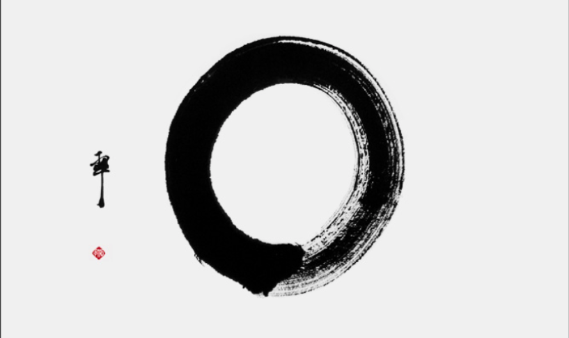

+++
title = "Karateprüfung 2 Teil"
date = "2021-01-17"
draft = false
pinned = false
image = "maru-dojo.png"
+++

Hier noch der [Link](https://maellernblog.netlify.app/karate-prufung/) zu ersten Teil des Blogs.

In diesem Blog schreibe ich was ich an der Prüfung machen musste. Was ich für eine Beurteilung bekam und wie es mir ergangen ist.

Was ich machen musste.

* Ich zeigte die Kata Fukyu-Gata-Nidan die ich im ersten Teil [verlinkt](https://www.youtube.com/watch?v=UfO5SJ94zro&list=PLPlAHovKSLl3S_8eNjoBPOoD8f2k5lm7c&index=7) habe.
* Dazu zeigte ich das gesamte Technikprogramm das ich hier [verlinkt](https://www.youtube.com/watch?v=_5s5mR6iMKQ&list=PLPlAHovKSLl3fwdysiBexsknujsb5qj77&index=8) habe.
* Danach musste ich noch 50 Kniebeugen und 40 Liegestützen auf denn Fäusten machen. Wer Lust hat, kann es gerne ausprobieren und mir schreiben wie anstrengend sie es finden.

Wie ich die Prüfung erlebt habe. 

Sie war anstrengend, cool, lustig und intensiv. 

Ich war am morgen vor der Prüfung sehr nervös und auch schon die Woche vorher. Ich kam um 11:30 an die Reihe aber war schon um 09:00 draussen vor dem Dojo am warten und mich aufwärmen. Meine Prüfung ging insgesamt 1 Stunde und ich habe sie mit "an der Grenzu zu Ausgezeichnet" bestanden, worauf ich sehr stolz bin.