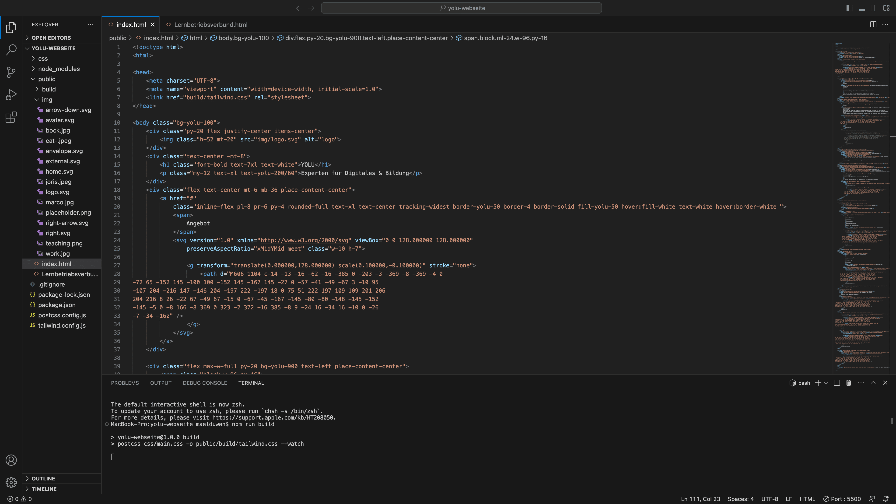

+++
title = "Learning by doing"
date = "2023-08-11"
draft = false
pinned = false
image = "bildschirmfoto-2023-08-11-um-16.09.12-min-1-.png"
+++

Ich habe letzten Mittwoch meine Lehre als Mediamatiker bei YOLU gestartet und habe gleich mit einem Html & css Tutorial gestartet, dieses habe ich dann auch gleich am Mittwoch abgeschlossen und habe somit meinen ersten Konntakt mit html und css gehabt. Den Link zum Tutorial findet ihr hier: https://code.makery.ch/de/library/html-css/

Von diesem Zeitpunkt an widme ich mich nun seit ganzen sieben Tagen der Aufsetzung unserer YOLU Webseite. Zum anfangen habe ich mir das Framework system Tailwind css Installiert und mir ein Par Youtube Tutorials angeschaut damit ich eine Grundlage hab auf der ich aufbauen kann. Im moment bin ich immer noch sehr viele Grundlagen am lernen Zmb. was welcher tag macht oder welche Klassen was bewirken, wie ich am besten Knöpfe programmire oder was ein grid/flex System ist. Momentan komme ich eigentlich jeden Abend mit einem rauchenden Kopf nach Hause da ich jeden Tag enorm viel neue Sachen sehe und lerne. 

Das Highlight von dieser Woche war, als die Webseite endlich die richtigen Background, text und Knopf Farben hatte, denn das verändert das Gesamtbild von einer Webseite enorm und lässt sie inert kürze nicht mehr wie eine absolute leihen Seite Aussehen.

Ich hoffe ich konnte euch einen Einblick in mein lernen geben und euch in einer art ein bisschen inspirieren.