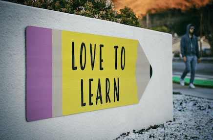

+++
title = "Nun bin ich voll im System! "
date = "2023-09-20"
draft = true
pinned = false
image = "bildschirmfoto-2023-09-20-um-11.43.20.png"
+++

Nach gerade mal vier Wochen in der Berufsschule habe ich mich dazu entschieden, dass ich nicht mehr lerne um zu lernen sondern das ich einfach nur noch auf die Notenrelevanten Tests lerne. Denn alles andere ist sinnlos. Wenn ich alle Hausaufgaben so gründlich machen würde, wie ich es in den ersten drei Wochen getan habe, dann wär ich innert kürze in einer absoluten Stresssituation und vielleicht bald am Rand der maximalen Psychischen Belastung. Da ich habe neben der Schule noch Hobbys habe, wie z.B. Karate, JiuJitsu, Basketball. Dann gibt es noch meine Familie und Freunde mit denen ich auch gerne Zeit verbringen möchte. Habe ich einfach nicht die Möglichkeit mir so viel nur für die Schule herauszunehmen. Deswegen habe ich mich dazu entschieden das ich nicht mehr Lerne um zu lernen sonder Lerne damit ich gute Noten habe. Dies ist eigentlich genau das was ich nicht wollte, den am liebsten würde ich auch in der Schule lernen weil es mir spass macht und mich interessiert, doch in diesem System ist dies einfach nicht möglich. 

Die einzigen 4 Punkte wo mir den einstieg und das überstehen dieses Systems einfacher machen sind

1. Meine Familie die mich in allem unterstützt und mir in keinster weise druck macht. Meine Eltern helfen mir bei allen Schulischen Sachen die ich nicht verstehe oder ich noch Hilfe brauche. Mit meinem Bruder kann ich auch einfach mal abschalten und eine gute Zeit haben. Durch das können mich die Themen der Schule, wie Testen oder Hausaufgaben, nicht annähernd so stressen, wie sie es sonst tun würden. 

2. Ich bin in einem Lernbetrieb zuhause in dem es nicht schlimm ist wen ich einmal keine gute note Schreibe, ich kann sagen wie es mir geht und sie verstehen mich. Der Lernbetrieb würde mir auch helfen wenn ich mit etwas nicht klar käme oder ich sonst irgend ein Problem hätte. Auch dies hilft mir, den dadurch habe ich keine weiteren Stressfaktoren oder Notendruck vom Lernbetrieb.

3. Meine Freunde sind für mich ein "Ort der Erholung" wenn ich mit ihnen Lache, Sport treibe, über Gott und die Welt diskutiere oder auch einfach mal die Zeit geniesse in der wir zusammen hocken und Musik hören. In all diesen Momenten kann ich alles um mich herum Vergessen und mich einfach der situation ergeben. Dadurch kann ich mich bei ihnen erholen und wider Energie auftanken.

4. Die klasse in der ich bin, ist absolut das Umfeld in dem ich mich bewege, sie besteht aus verschiedenen Persönlichkeiten jeder hat seine qualitäten und ist auf seine Art Einzigartig. Genau in so ein buntes Umfeld gehöre ich, denn dort fühle ich mich wohl und willkommen. Ich konnte, in meiner Klasse, jetzt schon spannende und tolle Personen kennenlernen, hab schon lustige Momente erlebt und hoffe auf weitere.

Eigentlich Liebe ich zu lernen und neues zu entdecken, solang ich nach meinen Interessen lernen kann und darf. Doch in diesem System heisst es einfach du musst dies und dass können egal ob du willst oder nicht, und genau das ist für mich schwierig denn ich bin mir gewohnt nach meinen Interessen und Bedürfnissen zu lernen, denn wen ich das darf lerne ich enorm schnell und ohne Probleme, schreibt man mir hingegen vor was ich zu lernen habe ist dies für mich ziemlich schwierig, da ich mich teils kaum dafür interessiere. Dazu kommt das ich in einem Schultag so viele infos in mich verschlingen muss das ich nicht mehr aufnahmefähig bin, dies wiederum wirkt sich Negativ auf mein Lernverhalten und meine Lerneffizienz aus. Deswegen komme ich mit diesem System nicht gut zu Schlag.

Wie ich es trotzdem schaffe mich auf Tests vorzubereiten:

Ich Mache alle aufgaben der Woche am Wochenende und lerne dann gleich für die Tests der nächsten Woche. Durch das Lerne ich nur noch das nötigste (für die nächsten testen) und vertiefe mich kaum noch in Themen.

Langsam passe ich mich an doch ich werde mich sicher nie ganz an dieses System gewöhnen können. Es wird später auf diesem Blog, sicher erneut einen Eintrag zu diesem Thema geben.