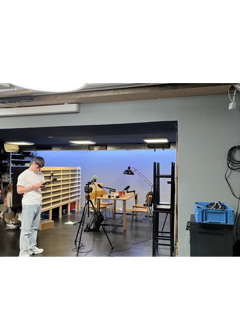

+++
title = "Projekte blühen wie Blumen im Frühling."
date = "2024-05-31"
draft = false
pinned = false
image = "klein-podcastnr1-.png"
+++

Bei uns mit YOLU geht es gerade sehr schnell in vielen Projekten los und weiter. Eines davon ist ein Podcast-studio das wir gerade innerhalb von 3 Wochen aufgestellt haben und schon am 30. Mai die erste Kundin in unserem Studio hatten die einen Podcast aufgenommen hatte und völlig zufrieden war. 

Ein weiteres Projekt ist das wir für das EHB Testimonials aufgenommen haben und diese auch gerade am schneiden sind. Dies ist nicht gerade gleich gross wie mit einem Lean Startup für Podcasts mit Video durchzustarten und innerhalb von 3 Wochen ein Studio aufzubauen dieses zu testen und nochmals Verbesserungen vorzunehmen, aber es ist auch nicht gerade ein kleines Projekt denn Joscha und ich leiten das ganze Projekt eigentlich alleine (mit der Hilfe von unseren „Chefs“ im Hintergrund), auch die Kommunikation zwischen dem Kunden übernehmen wir zu fast 100%.

Wir haben auch noch ein Paar «Side-quests» zu tun, wie z.B. einen Socialmedia account für YOLU aufzubauen mit wöchentlichen Reels, die [Berufsschule](https://www.joschatschanz.ch/sidequest-berufsschule/), oder auch bei einem Projekt mitfiebern ([Weckuum](https://www.weckuum.ch/)) das wir erst gerade abgeschlossen haben. In diesem Projekt haben wir mit Lukas das Video für sein Crowdfunding gedreht und geschnitten. 

**Zurück zum Podcast-Projekt:**

Wir haben, wie bereits erwähnt, innerhalb von 3 Wochen ein Podcast-studio aufgebaut, doch dieses musste ja auch noch getestet werden. Dies haben wir nach dem Organisieren von dem Material (2x Shure MV7 Mikrofone, 2x passende Ständer für die Mikrofone, einer Sony a6300, einer Sony a6000und 2x Kit Lens), eine Woche vor dem Ersten gültigen Podcast Termin mit einer Kundin und ziemlich spontan getan. Bei den Proben sind uns noch recht viele Sachen aufgefallen, wie zum Beispiel: Wir brauchen neue Objektive und eine Zweite a6300 Kamera, auch das Licht müssen wir noch weniger auf dem Hintergrund haben damit die LED färben auch ein bisschen zum Ausdruck kommen. All dies haben wir dann innerhalb von einer Woche gefixt und eingekauft, so dass unser Equipment jetzt so aussieht: 

* 1x Sony a6300 Kamera
* 1x Sony a6400 Kamera
* 2x fix 50mm & 1.8 Blende Objektive
* 2x Shure MV7 Mikrofone
* 2x Ständer für die Mikrofone

Und mit diesem Setup haben wir dann unseren ersten Podcast aufgenommen und auch gleich am Tag darauf verschickt. Die Kundin ist sehr zufrieden mit unserer Arbeit und freut sich über die Aufnahmen.

**Einige Erkentnisse noch zum Schluss:**

Wenn ich Videos aufnehme bin ich recht entspannt abgesehen davon das ich teils dass Gefühl bekomme «was ist wenn es einen teil nicht aufzeichnet, oder etwas beim speichern schief geht» aber ich denke das ist normal und auch völlig okay so. 

**Fazit:**

Meine Lehrer ist im Moment ziemlich stressig aber auch enorm spannend da ich unglaublich viel neues kennenlerne, dadurch kann ich dann meinen Horizont erweitern und meine Fähigkeiten sowie auch mein wissen weiter ausbilden. 

Alle die mich kennen wissen dies schon aber, ohne meinen Sport als Ausgleich, sind für mich solche Wochen fast nicht aashaltbar. Da ich dann enorm viel Energie nicht abbauen kann die ich abbauen muss, damit ich entspannt und nicht nervös («hibbelig») in den neuen Tag starte.