+++
title = "Tief in der Bildbearbeitung"
date = "2024-12-04"
draft = false
pinned = false
image = "klein-_i2a7466-.png"
+++
Ich war, wie in einem vorherigen [Blog](https://www.maelduwan.ch/uberwaltigende-momente/) schon erwähnt, diese Herbstferien in Tansania auf Safari. Dort habe ich viele Fotos von Tieren aller Art erstellt. Diese Bilder habe ich dann noch in einem Zeitrahmen von ca. 35–40 Stunden bearbeitet und bin nun fertig mit allen Bildern, die ich bearbeiten wollte. Während dem Bearbeiten der Bilder habe ich sehr viel gelernt und einen Teil davon werde ich nun in diesem Blog mit euch teilen.

Wichtige allgemeine Learnings zum Bearbeiten von Bildern:

1. Solange man die Fotos als RAW aufnimmt, kann man die Bilder in der Post-Production noch sehr gut aufhellen und verdunkeln, auch wenn sie eigentlich zu dunkel/hell wären.
2. Je mehr man mit einem Editing-Tool arbeitet, desto effektiver und schneller wird man.
3. Mit der Zeit entwickelt man einen eigenen Workflow, der einfach für sich als Person am besten passt.
4. Bei den Basic-Adjustments kann man einem Bild einen bestimmten Overall Look verleihen, während man mit den Masken Teilen vom Bild verstärkt mit der Belichtung, damit man den Fokus auf das lenken kann, wo man möchte.
5. Unglaubliche Bilder im Internet sind wahrscheinlich, abgesehen davon, dass diese Situation wirklich geschehen ist, auch sehr stark bearbeitet, und erst das macht dieses Bild so gut, denn sonst wäre das Bild eher langweilig.

Nun zu praktischen Beispielen, wie ich das Bearbeiten gelernt habe und was ich mir für Gedanken mache, während ich die Bilder am Bearbeiten bin.

Die Grundlagen vom Bearbeiten von Bildern habe ich mir selber durch Üben und längerer Zeit angeeignet. Doch um dann diese Wildlife-Bilder richtig bearbeiten zu können, habe ich mir dann noch diese 2 YouTube-Videos angeschaut: 

<https://www.youtube.com/watch?v=ZdeoYyML7s4> 

<https://www.youtube.com/watch?v=RDXurR7ji_Y>

Aber was ist jetzt eigentlich mein Workflow? Mein Workflow ist wirklich sehr ähnlich wie in einem YouTube-Video, das ich oben verlinkt habe, denn ich habe mir dort die Schritte abgeschaut, nur habe ich einen bisschen längeren Arbeitsprozess, da ich teils, wie in einem späteren Beispiel zu sehen, eine unnatürliche Lichtquelle in das Bild reinsetze.

**Beispiel Nr. 1 von Bildbearbeitung:**

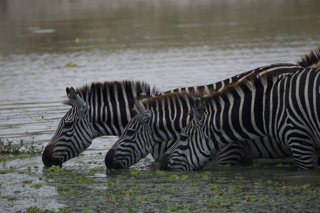

(RAW sieht das Bild so aus)

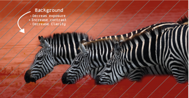

Als erstes bearbeite ich immer den Hintergrund. Dort verringere ich meistens die Helligkeit, erhöhe den Kontrast und verringere die Klarheit, damit dieser einen noch stärkeren Blur bekommt, da dies hilft, den Fokus auf das Sujet zu legen.

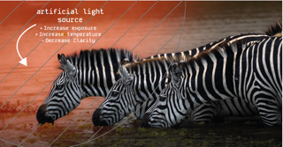

Als zweites habe ich bei diesem Bild die künstliche Lichtquelle hinzugefügt. Hier habe ich die Helligkeit erhöht und auch die Temperatur wärmer gemacht, damit das Bild aussieht, als ob es bei Sonnenuntergang (Golden Hour) fotografiert wurde. Auch hier habe ich wieder die Klarheit verringert, damit das Licht einen soften Touch hat und nicht zu künstlich aussieht.

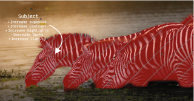

Als drittes habe ich das Subjekt ausgewählt. Bei den Zebras ist es wirklich schön, wenn man einen starken Kontrast zwischen den schwarzen und weißen Streifen auf ihrem Körper hat, deswegen habe ich als Erstes die Helligkeit allgemein leicht erhöht, doch dann auch starken Kontrast eingefügt, und um diesen zu verstärken, habe ich noch die hellsten Stellen (weiße Streifen) heller gemacht und die dunkelsten Stellen (schwarze Streifen) verdunkelt. Zum Schluss habe ich noch die Klarheit erhöht, damit die Zebras auch wirklich möglichst scharf sind.

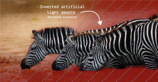

Als vierten Schritt habe ich die künstliche Lichtquelle invertiert (alles andere ausgewählt als die künstliche Lichtquelle). Dort habe ich nur die Helligkeit ein bisschen verringert, damit das Bild noch mehr die Zebras mit dem Sonnenuntergang im Fokus stehen.

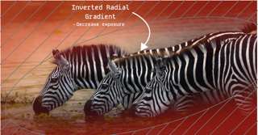

Als fünften und zweitletzten Schritt habe ich alles rund in einem Umkreis um die Zebras ausgewählt. Diesen Bereich habe ich dann auch einfach noch ein wenig verdunkelt, damit das Auge unterbewusst auf die Zebras gelenkt wird.

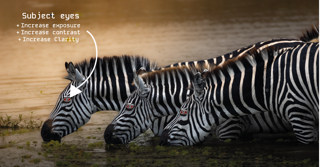

Zum Schluss habe ich die Augen vom Subjekt ausgewählt. Diese habe ich ein wenig erhellt und vor allem die Klarheit erhöht, damit diese nicht einfach im Bild untergehen oder unnatürlich erscheinen.

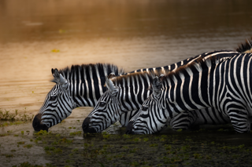

Fertig bearbeitetes Bild sieht dann so aus.

**Beispiel Nr. 2 von Bildbearbeitung:**

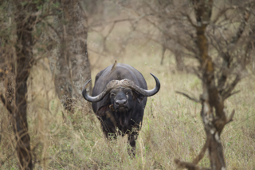

(RAW sieht das Bild so aus)

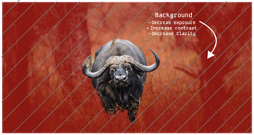

Auch hier habe ich wieder mit dem Hintergrund angefangen. Und auch hier habe ich den Hintergrund dunkler gemacht, den Kontrast erhöht und die Klarheit verringert.

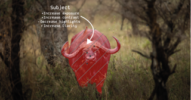

Bei diesem Bild habe ich aber als zweites das Subjekt bearbeitet. Aber auch hier habe ich wieder die gleichen Sachen wie beim letzten angepasst, einfach mit dem Unterschied, dass ich hier die hellen Stellen nicht noch heller, sondern dunkler haben wollte, deswegen habe ich die Highlights verdunkelt.

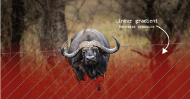

Bei diesem Bild gab es den Boden, den ich ein bisschen verdunkeln wollte. Dafür habe ich einen Linear Gradient erstellt und dort einfach die Helligkeit verringert.

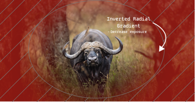

Dann habe ich noch eine Vignette erstellt, damit das Auge in die Mitte geleitet wird und auf das Sujet geleitet wird.

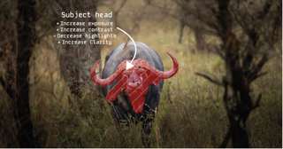

Als letztes habe ich den Kopf vom Büffel noch ein wenig heller gemacht, die Klarheit erhöht und den Kontrast dort verstärkt, damit der Fokus noch mehr auf dem Kopf liegt. Bevor ich das Bild exportiert habe, habe ich noch die hellsten Stellen dort ein wenig verdunkelt, da sonst die Hörner des Büffels eher unnatürlich hell gewirkt haben.

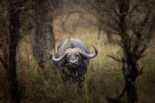

Fertig bearbeitetes Bild sieht dann so aus.

Dies ist mein Workflow beschrieben und um meine ganzen Lerneffekte zusammenzufassen, liste ich sie nun hier auf:

* Wie ich meine Bilder so bearbeite, dass mein Sujet im Fokus ist, ohne dass es unnatürlich wirkt.
* Wie ich den Lichtfall von der Sonne repliziere, ohne dass es bemerkt wird.
* Wie viel es ausmacht, wenn ich den Hintergrund in der Post-Production nochmals ein wenig verschwommener mache und wie stark der Fokus auf mein Sujet gelenkt wird, wenn ich dieses dann wiederum schärfer mache.
* Welche Schritte es alle braucht, damit ich ein Bild wirklich fertig bearbeitet habe.
* Framing habe ich während des Fotografierens immer mehr in das Gefühl bekommen.
* Wie ich am besten darstellen kann, wie und was ich bearbeitet habe.
* Das Auswählen aus mehreren guten Bildern bis zum Punkt, dass ich sie von 2.856 auf 13 beschränkt habe (sind ganz am Schluss vom Blog angehängt).
* Jegliche Tools von Lightroom Classic und Lightroom besser kennengelernt.
* Für mich herausgefunden, dass ich Lightroom Classic besser als das neue Lightroom finde.
* Jeder, der ein Bild bearbeitet, präferiert andere Punkte, und deswegen wird das gleiche Bild von 4 verschiedenen Personen komplett verschieden bearbeitet.

Ich werde alle Bilder in den nächsten 8 Wochen auf meinem Instagram-Account veröffentlichen, falls jemand mich unterstützen möchte oder sich für meine Arbeit interessiert, geht doch gerne auch dort mal vorbeischauen: [@mael_showroom](https://www.instagram.com/mael_showroom/)

Ein paar meiner Lieblingsbilder von der Safari:

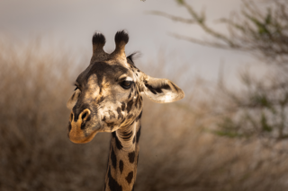

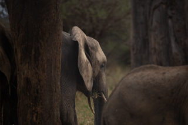

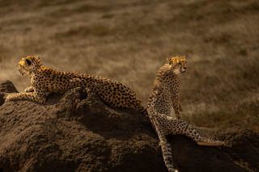

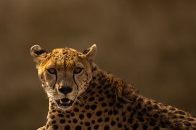

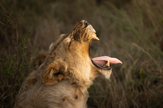

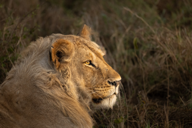

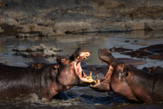

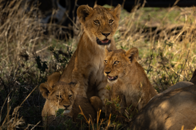

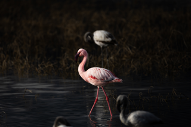

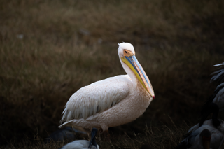

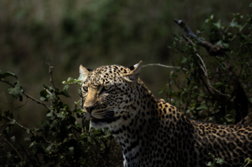