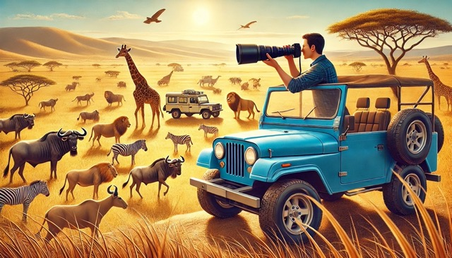
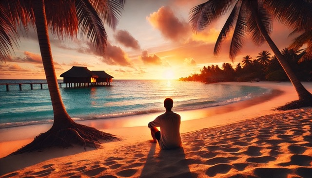

+++
title = "Überwältigende Momente"
date = "2024-10-23"
draft = false
pinned = false
image = "person-auf-safari-mit-grosser-kamera.jpeg"
+++

Ich war mit meiner Familie zwei Wochen in den Ferien in Tansania und Sansibar. Dort habe ich eine Tierwelt entdecken dürfen, die ein Grossteil der Menschen wahrscheinlich nie in ihrem Leben sehen wird. Denn wir waren fünf Tage auf einer Safari und dann auch noch in einem Korallenriff schnorcheln. Wir haben, egal ob an Land oder im Wasser, eine Vielzahl und Vielfalt von Tieren gesehen, die ich mir noch nicht einmal vorstellen konnte. Man kann sich nicht vorstellen, wie es ist, eine Herde von Gnus und Zebras zu sehen, die nicht endet. Egal, wo man hinsieht, es sind einfach rundum nur riesige Grasflächen mit gefühlt unendlich vielen Zebras und Gnus. Dann fährt man insgesamt 15 Minuten auf einer Strasse mit ca. 40 km/h, und erst dann kommt man an das Ende der Herde. Eine solche Anzahl von Tieren auf einem Platz ist, als ob man einer Ameisenstrasse folgt, jedoch sind die Ameisen genauso gross wie du.

Eine andere Szene, an die ich mich sehr gut erinnern kann, ist, als wir zu einem Naturpool gefahren sind und plötzlich waren dort insgesamt ca. 120 Nilpferde, die wirklich riesig sind und alle so dicht aufeinander, dass man sich schon fragt, wie die überhaupt noch atmen können.

Es gab noch ganz viele weitere atemberaubende Ereignisse, doch um all diese zu schildern, würde es sehr lange dauern, und da dieser Blog auch dazu da ist, mein Lernen zu dokumentieren, gehen wir nun zu diesem Punkt über.

Ich habe vieles gelernt. Zum Beispiel habe ich noch besser gelernt, mit einer Kamera umzugehen und mit einem so grossen Objektiv (das ein ordentliches Gewicht hat) schnell zu reagieren, damit ich dennoch gute Bilder bekomme. Ich habe ausserdem gemerkt, wie sich mein Auge für Bildkompositionen innerhalb kürzester Zeit weiterentwickelt hat. Denn noch am ersten Tag habe ich Bilder gemacht, die ich nicht schlecht finde, jedoch habe ich schon am zweiten Tag Bilder geschossen, die das Tier viel besser in Szene setzen, und dies hat sich dann auch in den folgenden Tagen nochmals verbessert. Ich denke, dies ist etwas, das man sich nur mit der Zeit und vielem Probieren aneignen kann. Denn Framing ist ein so grosses Thema, das man nicht theoretisch lernen kann, denn praktisch ist es dann immer wieder anders. Über eine gewisse Zeit entwickelt man dann einfach ein Gefühl dafür, was gut aussieht und weshalb dies gut aussieht.

Ich habe ausserdem das Kameramodell Canon R6 Mark II kennengelernt und überlege mir nun, eine solche zu kaufen, da ich mit dieser wirklich gut ausgekommen bin und sie sich für mich sehr handlich angefühlt hat. Ich habe auch ihre Einstellungen für mich eingerichtet und dadurch entdeckt, welche Möglichkeiten diese Kamera hat, und denke, dass sie für die Bilder, die ich machen möchte, eine Kamera ist, die sich sehr gut eignet.

Im Nachhinein, also jetzt, werde ich mich noch intensiv damit auseinandersetzen, wie ich Wildlife-Fotografie am besten bearbeite, was für mich sicher auch nochmals eine grosse Lernkurve sein wird, da ich mich bisher noch nicht sehr stark damit auseinandergesetzt habe.

In einem meiner letzten Blogs ging es um Plakatdesign, und ich überlege mir auch hier schon, ob ich vielleicht wieder ein paar Plakate mit meinen Bildern und Designideen verzieren möchte und diese dann vielleicht verschenke oder bei mir selber im Zimmer aufhänge.

Um diesen Blog noch abzuschliessen, erzähle ich noch von Sansibar, denn dort habe ich keines meiner 2856 Bilder gemacht, doch auch auf Sansibar gab es Sachen zu sehen und zu erleben, die ich mir nicht wirklich vorstellen konnte. Zum Beispiel waren wir an einem Strand, und dieser war wirklich wie in einem Traum, denn er war von rechts bis links ohne Ende und alles nur ganz weisser Sand, und das Meer war türkisblau. Dieses türkisblaue Meer war so warm, dass es einem nicht kalt wurde, auch wenn man noch so lange im Wasser war. In diesem Meer waren wir schnorcheln, und wir haben Fische gesehen in Hülle und Fülle. Teils waren es so viele, dass man durch sie hindurchtauchen konnte, und sie haben sich wie ein Vorhang geöffnet und hinter einem wieder geschlossen. Dadurch, dass sie sich hinter dir wieder geschlossen haben, konnte man in der Mitte anhalten und war umkreist von einem Riesenfischschwarm, der sich einfach um einen herum bewegt hat.

Alles in allem war dies eine der schönsten Reisen, die ich in meinem Leben gemacht habe, und ich danke meinen Eltern für das Ermöglichen einer solchen Reise mit einem solchen Kameraequipment und für die unvergesslichen Momente, wie einen 70 cm Thunfisch zu angeln und diesen dann auch noch am gleichen Abend zu essen.

Ich werde in einem folgenden Blog sicher noch darüber dokumentieren, wie und was ich gelernt habe beim Bearbeiten der Bilder, und dort werden diese dann sicher auch zu sehen sein.