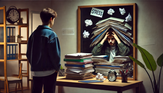

+++
title = "Vielleicht prägt mich das System doch mehr, als es mir lieb ist…"
date = "2024-10-30"
draft = false
pinned = false
tags = ["Schulsystem"]
image = "klein-gestresstes-spiegelbild-.png"
+++

Wie vor knapp über einem Jahr [versprochen](https://www.maelduwan.ch/neue-erkenntnis-doch-ist-diese-auch-gut/), gibt es nun ein Update darüber, wie es mir in diesem (Schul)system geht und wie ich mich an das Lernen nur für Tests und ohne Vertiefung in die Themen gewöhnt habe.

Im letzten Jahr geschah vieles, Gutes und auch weniger Gutes, denn zum Beispiel bin ich nicht mehr in der Klasse, in der ich mich so wohlgefühlt habe, sondern wurde in den Sommerferien durch eine Mail von jetzt auf gleich in eine für mich fast ganz neue Klasse verschoben. Dies tat dem Start in das neue Schuljahr nicht gerade gut, und ich war erneut sehr abgeneigt, in die Berufsschule zu gehen. Nach einer gewissen Eingewöhnungsphase habe ich mich aber mit der neuen Klasse abgefunden und verstehe mich mit einem Teil der Klasse wirklich gut. Doch hier hört das Spektakel noch nicht auf, denn wie ich in einem meiner Blogs erwähnt habe, habe ich teils starken Stress, wenn wir eine Prüfungsphase haben, da wir dann ca. fünf Prüfungen pro Woche für zwei bis vier Wochen schreiben, und es ist eigentlich so gut wie unmöglich, für all diese Prüfungen zu lernen. Aber es gibt gute Neuigkeiten, denn der Stress, den ich durch die Prüfungen hatte, ist auch jetzt noch nicht verschwunden, aber er ist nicht mehr so schlimm/stark wie am Anfang meiner Lehre. Jedoch kann ich mich immer noch nicht mit dem Schulsystem abfinden und habe immer noch Probleme damit, einfach zwei Tage in der Woche für etwas aufzuwenden, wo ich nicht wirklich einen Sinn dahinter sehe.

Nun zu einem Teil ausserhalb der Schule, der mir aber ein bisschen Sorgen bereitet. Denn ich habe teils angefangen, Probleme und Situationen wie in der Schule anzugehen, das heisst heruntergebrochen: Ich schaue nicht mehr, was der beste Weg ist, sondern welcher Weg den wenigsten Widerstand hat und wie ich am schnellsten fertig werde, jedoch dies auf Kosten der Genauigkeit und Klarheit. Dies hilft mir nicht gerade für ein motiviertes Arbeiten, da ich auch nicht ganz zufrieden bin.

Ich versuche immer, wenn ich merke, dass ich diese Situation oder das Problem mit meinem «Schul-Mindset» angehe, alles zu verwerfen und erneut zu beginnen, denn meist ist das Ergebnis besser, wenn ich nicht in meinem «Schul-Mindset» bin, denn dieses hilft eigentlich nur, um durch dieses System zu kommen.

Auch das Lernen in einem Thema gehe ich mit viel weniger Lust an, seit ich in diesem System bin, denn nun verbinde ich Lernen auch stark mit dem Lernen der Schule, was eigentlich nicht richtiges Lernen ist (was ich auch weiss). Jedoch muss ich mich immer wieder bewusst machen, dass Lernen Spass macht und «Lernen» nicht gleich «Lernen» ist. Denn das Lernen in der Schule ist Sachen auswendig lernen, die mich teils nicht interessieren und auch nicht weiterbringen im Leben. Doch eigentlich ist Lernen etwas Schönes, denn du entdeckst ein neues Thema und lernst ganz viele neue Skills etc. Nur wird das in der Schule nicht so vermittelt, und dadurch löscht sogar mir, der wirklich kaum Erfahrung in der öffentlichen Schule hat, das Lernen langsam ab. Ich denke, ich werde die Freude am Lernen aufrechterhalten können, da ich nicht 100 % in diesem System bin, sondern nur 40 %, und ich denke auch, dass ich nach der Lehre, sobald ich keine Berufsschule mehr habe, wieder viel motivierter sein werde, Themen auch theoretisch zu lernen, denn im Moment ist theoretisch lernen für mich immer mit vielen Stunden verbunden, die mir weder Spass machen noch einen wirklichen Mehrwert bringen.

Auch heute noch, wie schon vor einem Jahr, bin ich froh, dass mein Lehrbetrieb und meine Eltern keinen Notendruck ausüben. Ich bedanke mich hier erneut für diesen Umgang mit einem Stück Papier, das später in meinem Leben eh keinen Einfluss mehr haben wird, jedoch im Moment viel stärkeren Stress auslösen könnte, wären meine Ausbilder und meine Familie nicht so entspannt in Hinsicht darauf, dass das Ganze sicher schon gut kommt.

Der Umgang mit dem Thema Noten in meinem Umfeld stärkt mich in meinem Gedankengut, dass Noten, wie sie im Moment in der Schule praktiziert werden, nicht der richtige Weg sind, im einschätzen von Kindern, Jugendlichen oder Jungen Erwachsenen. Es stärkt mich auch, wenn ich weiss, dass, wenn ich (zum Beispiel in Französisch) mal wieder keine «gute» Note schreibe, ich diese dann nicht vor meinen Eltern verstecken muss, da ich sonst Angst haben müsste, dass ich nicht mehr mit Freunden raus darf, mein Handy mir weggenommen wird oder dass ich vom Lehrbetrieb sogar «freigestellt» werde.

Dies sind Teile meiner aktuellen Gedanken zum Schulsystem und wie ich mich selber in diesem System wiederfinde, welche Sachen für mich einfacher wurden, wie es mich beeinflusst und wie ich damit klarkomme.

Ich hoffe, dass ich in einem nächsten Blog über das Schulsystem schwärmen kann und euch erzählen, wie unglaublich toll es doch ist. Jedoch denke ich, wird das nie der Fall sein, denn die Weiterentwicklung des Systems geht so langsam voran, dass ich in meinen Lehrjahren wahrscheinlich nie ein wirklich gutes Schulsystem kennenlernen werde.