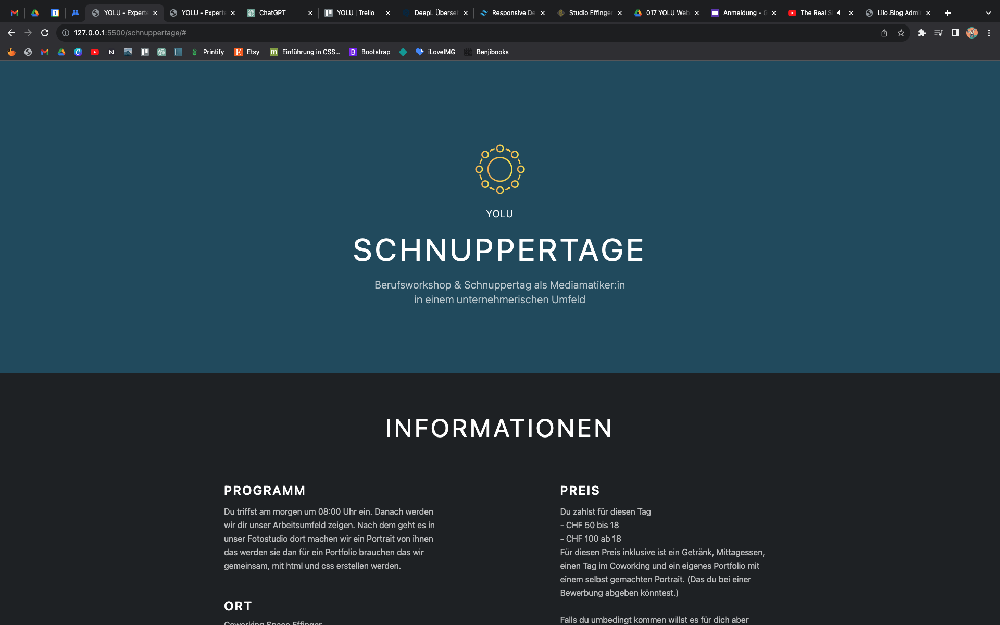

+++
title = "Was für eine Lernkurve"
date = "2023-09-01"
draft = false
pinned = false
image = "bildschirmfoto-2023-09-01-um-14.57.07-2-.png"
+++

\
Es ist unglaublich!

Vor 5 Wochen habe ich meine Ausbildung als Mediamatiker begonnen, und jetzt bin ich bereits in der Lage, mithilfe von Tailwind (HTML & CSS) eine Webseite zu erstellen, die meiner Meinung nach nicht mehr nur nach einem Experiment aussieht, sondern bereits ein gewisses (immer noch auf Anfängerniveau) Maß an Qualität erreicht hat.

Was ich noch fast unglaublicher finde ist, dass ich innerhalb von nur vier Wochen die zwei Seiten "Home" und "Lernbetriebsverbund" auf unserer Webseite yolu.ch programmiert habe. Und jetzt habe ich in nur drei Arbeitstagen (24 Stunden) eine dritte Seite hinzugefügt (diese ist jedoch, im Momment, noch nicht Online). Das bedeutet, dass ich in weniger als der Hälfte der Zeit dasselbe Ergebnis erzielt habe. Selbst für mich ist es schwer zu glauben, welche Lernkurve ich in dieser Zeit durchlaufen habe. Der Effinger ist sicherlich nicht unschuldig daran, denn hier herrscht ein äußerst kreatives und spannendes Umfeld, in dem ich mich mit vielen Menschen austauschen kann. Dadurch habe ich eine hervorragende Grundenergie entwickelt, um konzentriert und effizient arbeiten zu können.

Falls Sie mehr über meine weiteren Projekte, Lernorte und Erfahrungen erfahren möchten, schauen Sie gelegentlich auf meinem Blog vorbei und lernen Sie gemeinsam mit mir.