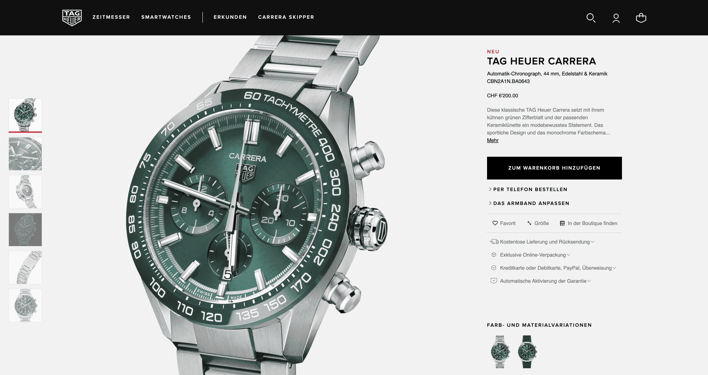

+++
title = " Welche Uhr ich mir mal Kaufen will und wieso ich genau diese haben möchte.   (Übung Benefits)"
date = "2023-09-05"
draft = true
pinned = false
image = "bildschirmfoto-2023-09-05-um-21.02.03.png"
description = ""
footnotes = "Diesen Blog habe ich für die Berufsschule (BBZ-Biel) erstellt. \n\n***Info:*** dies ist der Blog für beide aufgaben, da sich diese, bei mir, überschneiden."
+++

Zielgruppe: Diese Armbanduhr ist für Leute die eher viel Geld haben. Sportliche Menschen zwischen 25 - 45 Jahren.

Feature (was es ist): Es ist eine Armbanduhr. Sie ist ein Accessoire, damit kann man seine Outfits erweitern. Es gibt sie in verschiedenen Versionen und Farben. Man kann sehen was gerade für Zeit ist. Sie ist sportlich Desingt, robust, schwer und stahlhart.

Benefit es bewirkt: Diese Armbanduhr ist ein Accessoire das man mit ziemlich vielen verschiedenen Farben, von Kleidern, kombinieren und gebrauchen kann. 

Emotionen (wie ich mich fühle / was es in mir auslöst): Ich hätte ein wohliges Gefühl da ich die Uhr tragen könnte die ich möchte und somit würde ich mich besser fühlen. Ich würde mich von meinem style (ausehen durch Kleider) sicherer fühlen.

Dies ist für die Zielgruppe: Leute mit eher viel Geld, Leute die sich gerne Prunkvoll anziehen. Diese Uhr ist für Leute zwischen ca. 25 - 99.

Feature (was es ist): Es ist eine Armbanduhr. Sie ist ein Accessoire, damit kann man seine Outfits erweitern.  Man kann sehen was gerade für Zeit ist.

Benefit es bewirkt: Die Benefits einer Armbanduhr sind generell ziemlich ähnlich.

Emotionen (wie ich mich fühle / was es in mir auslöst): Dies ist nicht gerade mein style. Ich würde diese Armbanduhr eher weniger anziehen. Sie ist mir einfach zu Luxuriös Designed und meine Kleider passen nicht unbedingt zu dieser goldenen Farbe.