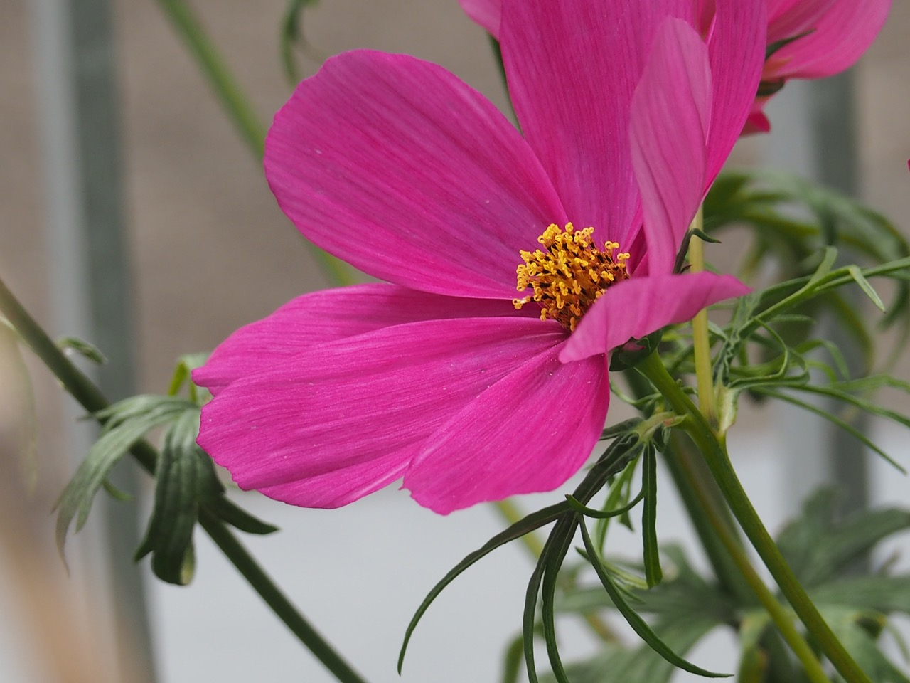

+++
title = "Wie ich und meine Familie die Corona Situation handhaben."
date = "2021-02-10"
draft = false
pinned = false
image = "p6220027.jpeg"
description = "Es ist jetzt etwa ein Jahr her als die Covid 19 Situation angefangen hat, hier erzähle ich wie ich sie erlebt und was mir hilft damit umzugehen."
+++

Ich und meine Familie machen aus der Covid19 Situatin das Beste was wir können.

 zum Beispiel. 

* Habe ich mir zu Weinachten Fairy Tail Bücher gewünscht. Meine Eltern und ich haben diese ganze Sammlung gebraucht gekauft und zusammen finanziert. 
* Wir haben Ski gemietet und gingen zusammen so oft wie möglich Skifahren.
* Ich und meine Familie haben von unserem Nachbaren einen Fussballkasten zum brauchen bekommen. Es macht richtig Spass mit meinem Bruder und meinen Eltern zusammen zu Spielen.
* Wir gehen in den Bounce Lab wenn wir können. Der Bounce Lab hat für alle Jugentlichen bis 16 Jahren offen. Als Elternteil kann man hingegen leider noch nicht einmal im Café sitzen sondern muss draussen warten.
* Worum ich auch sehr froh bin und was mir gute Struktur gibt ist das Karate Training, die Lernstatt und das Maht mit Joris.
* Schön ist auch wenn ich Freunde treffen kann und wir Zeit haben zum Klettern und Plaudern

Freue mich auf den Frühling!