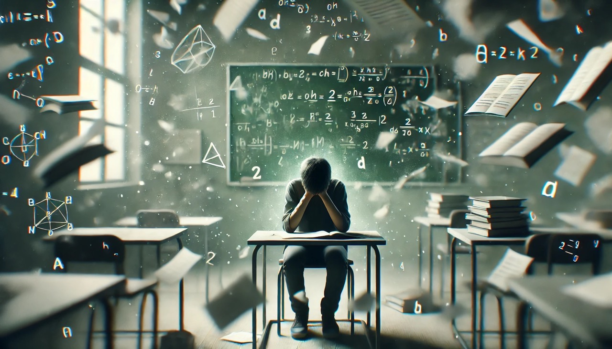

+++
title = "Wie viel Bildung steckt wirklich in der Schule?"
date = "2025-01-23"
draft = true
pinned = false
tags = ["Schulsystem"]
image = "schul-kritik_nr3.jpeg"
+++

Ich sagte in einem vorherigen Blog, dass ich in einem nächsten Blog am liebsten über das Schulsystem schwärmen würde. Dies kann ich jedoch auch jetzt nicht. Doch ich werde euch in diesem Blog ein par Verhaltensweisen von Berufsschulschüler aufzeigen und einige positive Punkte der Berufsschule versuchen zu vermitteln.

 

## Positive Punkte

#### Austausch

Der Austausch mit anderen Gleichaltrigen die die gleichen Interessen haben, ist eines der positiven Dingen der Berufsschule. Denn dadurch können wir spannende Diskussionen über verschiedenste Teile unseres Jobs führen und uns gegenseitig helfen wenn jemand Fragen oder ein Problem hat. Ein weiterer positiver Punkt ist, dass ich mich mit Personen austauschen kann, die ein ähnliches Interessensfeld haben und auch vom Wissen her auf einem ähnlichen Stand sind. Dies ist sehr interessant, da man so gut mit verschiedenen Perspektiven und Herangehensweisen konfrontiert wird und darüber sprechen kann.

 

#### Freunde

Neue Freunde finden oder Freunde in der Klasse auf dem Hin- und Rückweg sowie auch in der Schule selbst zu sehen. Sich mit diesen auszutauschen und lustige Momente zu erleben, ist sehr wichtig, schön zu erleben und ein Punkt den ich als sehr positiv empfinde. 

 

 

## Verhaltensweisen:

#### Eigene Projekte

Nun zu den Verhaltensweisen von vielen verschiedenen Schülern. Viele von den Berufsschülern verwenden die zwei ganzen Tagen pro Woche, um an eigenen Projekten zu arbeiten. Nicht wenige finden das Arbeiten an eigenen Projekten in der Berufsschule ziemlich spannend oder zumindest deutlich spannender als der Unterricht. Ein weiterer Punkt der von vielen als positiv empfunden wird, ist das wenn man an eigenen Projekten arbeitet man viel lernt. Denn wenn man dort an einem Ort ansteht oder ein Problem hat, hat man auch die Motivation dieses zu lösen. Zuletzt ist das Arbeiten an eigenen Projekten in der Berufsschule eine Art, wie man die Kompetenz des Multitaskings trainieren und weiter ausbilden kann. Denn man muss sich auf den Unterricht und gleichzeitig auf das eigene Projekt konzentrieren, und das hilft dabei, sich auch später auf mehrere Sachen gleichzeitig konzentrieren zu können.

 

#### Bulimielernen

Ca. 65% der Schüller:innen lernen (wenn überhaupt) am Wochenende für ungefähr 30 min pro Prüfung die sie in der nächsten Woche schreiben müssen, meist wissen sie bis zu diesem Zeitpunkt noch nicht einmal was genau der Inhalt der Prüfung sein wird sondern nur ungefähr um welches Thema es in der Prüfung gehen wird. Es gibt immer wieder die Situation in der man Personen im Zug, hört über den Test in 40 min sprechen und sie meinen: «Ich habe die Lernziele zwar seit drei oder vier Wochen, doch angefangen sie zu lernen habe ich immer noch nicht.» auf diese Aussage kommt dann meist die Antwort: «Dann fang doch jetzt an. Besser jetzt als gar nicht.» nach dem wird wahrscheinlich für ca. 10 min gelernt und dann heisst es wieder: «Ach komm, das bringt doch eh nichts mehr. Ich höre jetzt auf mit lernen» das ganze deutet auf Bulimielernen hin. Das heisst, das man den Test schreibt und am nächsten Tag schon wieder Vergessen hat was man gelernt hat, da man das ganze nicht im Langzeitgedächtnis hat. Bulimielernen ist etwas vom unnötigsten was es gibt, jedoch ist das heutige Schulsystem auf genau dem aufgebaut ist, denn zu 90% lernt man etwas komplett theoretisch und hat keine praktische Verbindung zum Thema und deswegen bleibt das gelernte nicht im Langzeitgedächtnis, sondern man vergisst es gleich nach der Prüfung. Dazu kommt das man in der Schule viel zu wenig Zeit hat sich mit den Themen tiefgründig auseinanderzusetzen denn nach 45 oder teils 90 Minuten wechselt die Lektion und das Thema wird völlig geändert, dadurch kann man gar nicht richtig in ein Thema eintauchen und sich damit lange und tiefgründig auseinandersetzten.

 

 

#### Ein Zitat das meine innere Überzeugung zu Bildung wiedergibt:

*“Bildung ist etwas Bewundernswertes; aber es ist gut, sich von Zeit zu Zeit daran zu erinnern, dass das Wissenswerte nicht gelehrt werden kann.”**[Oscar Wilde (Schriftsteller)](https://www.soulsaver.de/blog/kritische-zitate-ueber-das-heutige-schulsystem/)*

 

####  \
Homeschooling

An sich denke ich wäre der Ansatz gar nicht schlecht von selbständigem lernen, Vorbereitung auf eine Situation wie Corona usw. jedoch wird es nicht wirklich optimal umgesetzt. Denn über Teams 8 Stunden am Tag zu telefonieren und irgendwelche Theoretische aufgaben zu erfüllen, ist nicht gerade Zielführend. Wirklich konzentrieren kann man sich gerade in den erste 2 - 3 Lektionen denn alles spätere ist reiner Informationsüberschuss und kaum aufnehmbar, schon in der Berufsschule selbst ist dies eine grosse Herausforderung, doch im Distance-learning ist es wirklich kaum möglich sich über einen solchen Zeitraum richtig zu konzentrieren. Selbst für Personen die sich in der Schule richtig anstrengen und etwas lernen möchten ist das ein unglaublicher Kraftakt der viel zu viel Ressourcen verbraucht.

 

#### Notenstress

Einen der Grundsteine des Schulsystems ist die Notenvergabe und die Einschätzung durch eine Zahl auf einem Papier. Egal ob eine Person nun einen guten oder schlechten Tag hat sie sollte die gleiche Leistung hervorbringen wie an jedem anderen Tag, dies ist jedoch realistisch gesehen gar nicht möglich. Dazu kommt noch der Aspekt das jeder und jede das gleiche zum gleichen Zeitpunkt können sollte, doch dies wird nie der Fall sein, denn jede Person ist in einem Anderen Entwicklungsstadium und alleine durch diese zwei Faktoren wird der Noten unterschied in einer Klasse fast unglaublich sein. Wenn man das dann aber auf eine ganze Schule oder das System projiziert, kommen noch Aspekte dazu wie: Jede:r Lehrer:in bewertet anders, hat teils vielleicht auch einen Lieblings Schüler:in und stellt die Messlatte auf einem Anderen level als andere, was dann auf einen Klassenschnitt einen unglaublichen Impact haben kann. Dazu kommt das auf der einen Schule viel mehr gefördert wird als auf der anderen und dann haben einige Schulen noch interne Probleme die andere nicht haben. Durch all diese Faktoren wird der weg, egal ob ins Studium oder in eine Lehre, für jeden völlig anders ausgelegt. Dies ist nicht eine Faire Bewertung eines Menschen und das dadurch ein Stress bei jedem Schüler und jeder Schülerin entsteht da sie Angst haben müssen um ihre Zukunft, denn diese Noten die kaum etwas über eine Person aussagen, sind Heutzutage teils immer noch der ausschlaggebende Punkt ob man eine Person einstellt, eine Lehre oder ein Studium ermöglicht und damit wird für eine Person meist schon so viel in der Kindheit entschieden, wo sie gar keinen Einfluss hat. Vielleicht möchte die Person später Philosophie und Pädagogik studieren, dort wären sie dann völlig aufgegangen und hätten eine unglaubliche Begabung dafür, jedoch waren die Noten in der Kindheit nicht gut genug und deswegen musste die Person KV lernen. Für solche und auch andere fälle die vielleicht erst mit 20 den Knopf öffnen und sich Fachbücher etc. reinziehen ist es jedoch dann enorm erschwert diesen weg zu gehen den sie eigentlich gegangen wären.

 

#### Mobbing

Von dem Thema Noten zum Thema Mobbing. Diese Themen sind tatsächlich nicht sehr weit entfernt von einander, denn wer schlechte Noten hat wird eher ausgegrenzt und gemobbt. Nun könnte man sagen: «Ja, aber das würde ja sowieso in irgend einer art Ausgrenzung stattfinden» und das wäre noch nicht einmal völlig falsch, jedoch wird Ausgrenzung und Mobbing von Noten (egal ob gut oder schlecht) gestärkt. Denn hast du bessere Noten als der Durchschnitt wirst du als Streber abgestempelt und hast du schlechtere Noten als der Durchschnitt dann wirst du als Verlierer oder Dumm abgestempelt. Beides ist eine sehr unangenehme Situation der man nicht Ausweichen kann, egal ob man nun gut oder schlecht in der Schule ist. Nun ist das Thema Mobbing sowieso sehr schwierig, denn es gibt enorm viele unterschiedliche Aspekte wieso nun eine Person gemobbt wird. Doch nun stellen sie sich mal vor: sie sind in der Schule und geben ihr bestes, doch egal was sie machen sie schaffen es nicht auf eine richtig gute Note alles über einer 4 (in der Schweiz) ist schon fast ein Wunder und ungenügende gehören zu der Tagesordnung. Jetzt haben sie schon einen solchen Stress da dies die Zukunft von dir einschränkt und dazu wirst du gemobbt. In diesem Moment sollten die Eltern eigentlich Verständnis aufbringen und versuchen dem Kind möglichst bald aus der Patsche zu helfen, doch die meisten Eltern sind selbst zu beschäftigt mit Geld verdienen da sie schauen müssen das sie über die Runden kommen und sich vielleicht auch mal einen Urlaub leisten können. Aus diesem Grund beschäftigen sie sich nicht wirklich mit dir als Kind und deinen Problemen die du nicht selbst lösen kannst. Daraus entsteht dann das sie finden: «So schlimm ist das doch nicht. Nimm dich zusammen, ich habe das auch mal durchmachen müssen.» doch was sie in diesem Moment nicht bedenken ist das, dass Kind völlig machtlos ist und keine Chance hat sich zu wehren. Wenn man nun «Glück» hat dann wird das Kind trotzdem durch die Schule kommen und anschliessend eine Lehre oder sonst was finden, jedoch wird dieser Mensch für immer eine innere Narbe mit sich tragen die nicht einfach so verschwindet. Wenn diese Person dann gleich mit seinen/ihren Kindern so umgeht, dann ist das ein absoluter Teufelskreis. 

 

## Fazit

Ich habe in diesem Blog nun verschiedene sehr schwerwiegende Probleme und auch unangenehme Situationen im Berufs-Schulalltag benannt und beschrieben, ich hoffe jede Person die diesen Blog gelesen hat, kann eine Erkenntnis aus meinem Blick ziehen und Sieht nun vielleicht auch das System Schule mit ein Bisschen andern Augen. Wichtig für mich ist, das ich mit diesem Blog nicht Angst machen möchte oder die Schule in ein schlechtes Licht rücken möchte, ich möchte lediglich aufzeigen was dieses System alles für teils auch grössere Schwierigkeiten hat die man mal angehen sollte. Mir ist auch bewusst, das nicht alle Berufsschulen gleich sind, ich schreibe aus meinen Beobachtungen diesen Blog. Ich denke das längst nicht alle Berufsschulen gleich stark davon betroffen sind, jedoch denke ich, lassen sich Rückschlüsse auf das allgemeine Schulsystem schliessen.

 

Ich wünsche allen einen guten Verdauungsprozess mit diesem, doch sehr schweren, Thema und freue mich über Feedback. 

 

PS: Ich gehöre zu den Kindern bei denen die Eltern völlig richtig reagiert haben und für mich sobald es nicht mehr ging eine Lösung gefunden haben die dann völlig zu mir und meiner Persönlichkeit gepasst hat.            Merci viu viu mau <3