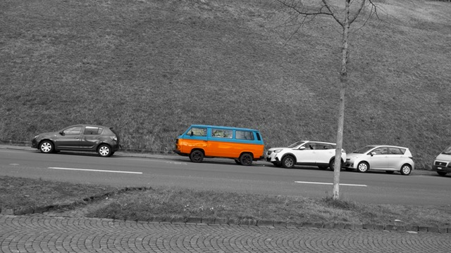
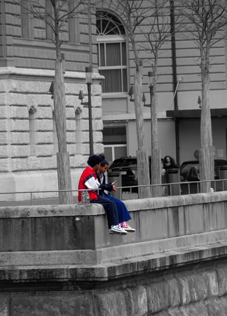
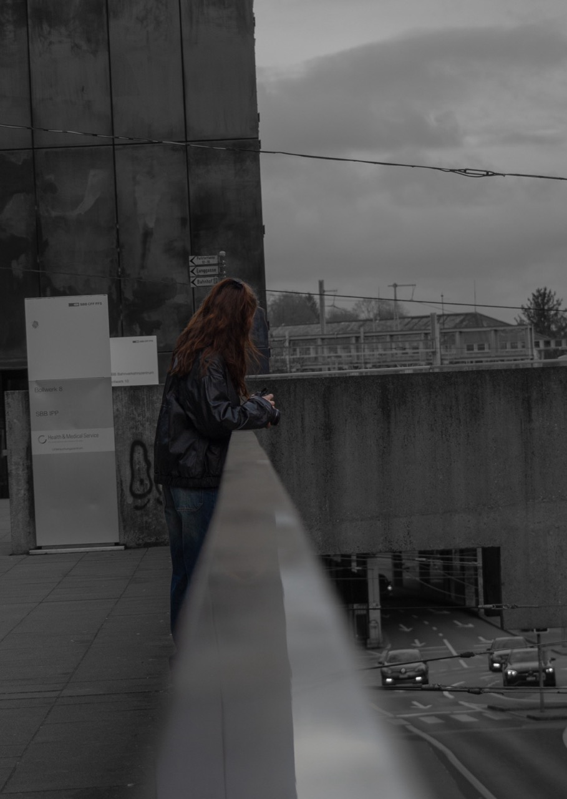
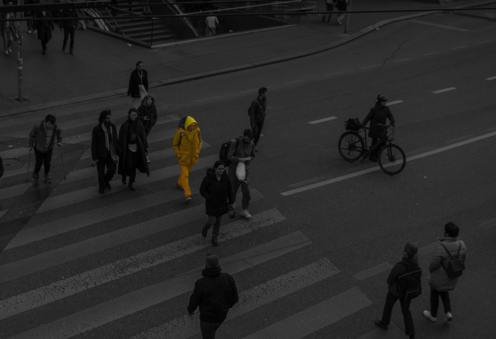
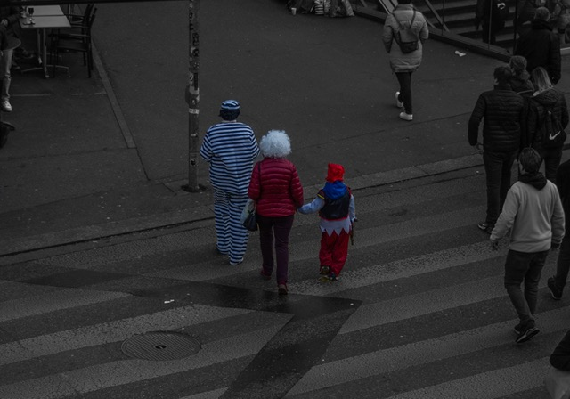
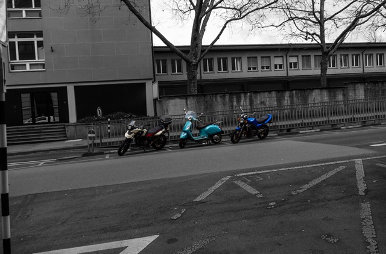
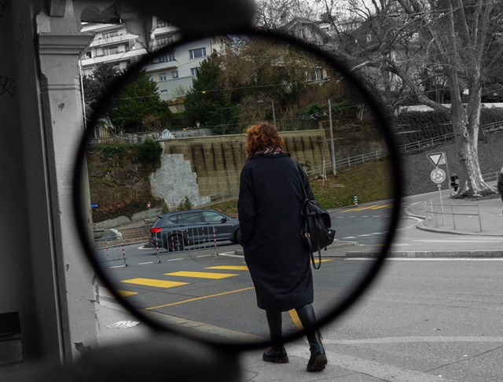
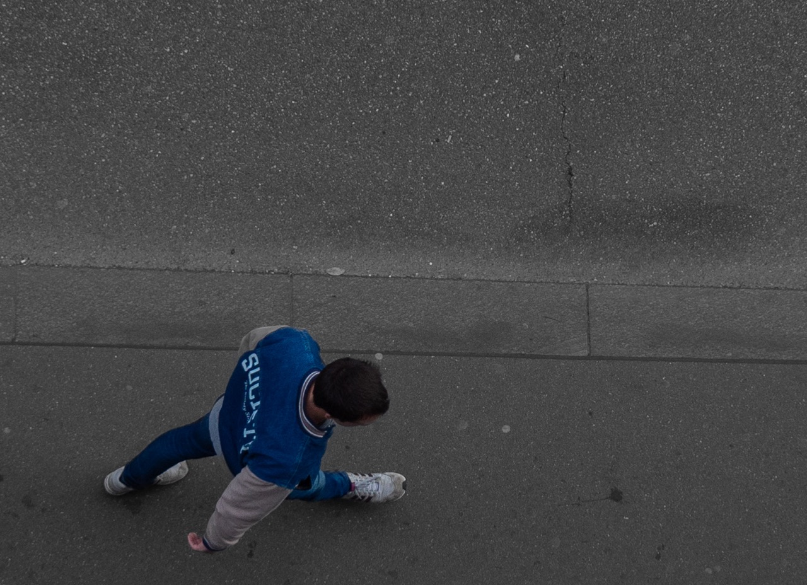
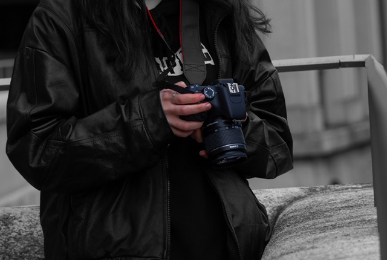

+++
title = "Wo führt mich diese nur Lehre hin?"
date = "2024-02-29"
draft = false
pinned = false
image = "mittel-p1010209-2-.jpeg"
+++

„Ist diese Lehre vielleicht doch nicht genau das, was ich mir wünsche?“ Genau diese Frage ist mir während der Prüfungsphase in der Berufsschule ab und zu in den Kopf geschossen, denn diese Prüfungsphasen sind immer enorm intensiv, und ich komme kaum aus dem daraus entstehenden Stress heraus.

Doch dann sehe ich immer wieder, was ich alles lerne und welchen Spaß das Ganze im Effinger macht. Ein weiteres Indiz, dass ich trotzdem große Freude an der Lehre habe, ist, dass ich vor kurzem an einem Samstag Nachmittag mit meiner Freundin in der Berner Stadt fotografieren war (es war gerade noch Fasnacht). Dies machte mir solchen Spass, dass ich noch am selben Abend die Bilder für 2:15 Stunden bearbeitet habe.

**Die Ergebnisse:**

Schwarz-Weiss Fotografie mit farbigem Motiv.

Daran merkte ich, dass sich meine Interessen in der Lehre im Moment sehr ändern, denn momentan interessiere ich mich immer mehr für das Themenfeld Film und Fotografie. Mit den ganzen Möglichkeiten wie FPV-Drohnen, oder wie eine Kamera funktioniert und deren besten Einstellungen, mit Belichtungszeit, Brennweite etc. kann man sich ohne Probleme vertiefen. Wo ich mich auch verlieren kann, ist das Thema Storytelling oder in der Bildbearbeitung, denn was alles in der Nachbearbeitung, mit den Farben und den Texturen oder Effekten noch möglich ist, verblüfft mich jedes mal aufs neue.

Eines der grössten Learnings, das ich dadurch hatte, war: „Alles hat negative Seiten, manchmal braucht es einfach Zeit und Durchhaltevermögen, dann kommen auch wieder sonnige Zeiten.“ Zusätzlich bin ich für mich zum Schluss gekommen, dass ich diese Berufslehre wie angedacht abschliessen werde und mich bestmöglich durch dieses Schulsystem schmuggle.

**Schlusswort:** Die Lehre macht mir Spass, und mein Betrieb, sowie die ganze Community (Effinger) rundherum, ist wunderbar. Man lernt innert kürzester Zeit unglaublich viel und tauscht sich über etliche wichtige und tiefgründige Themen aus.